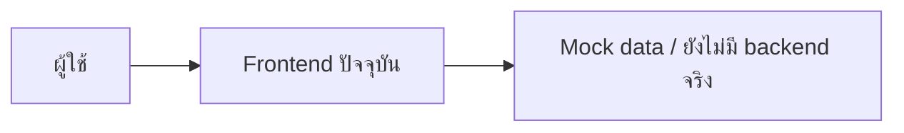
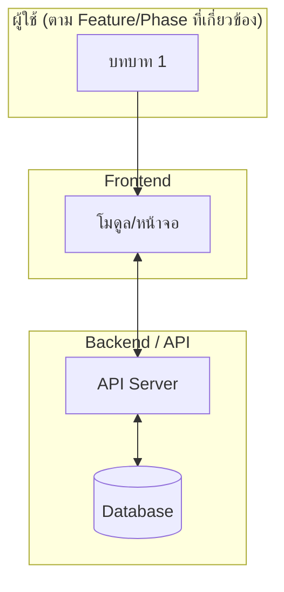
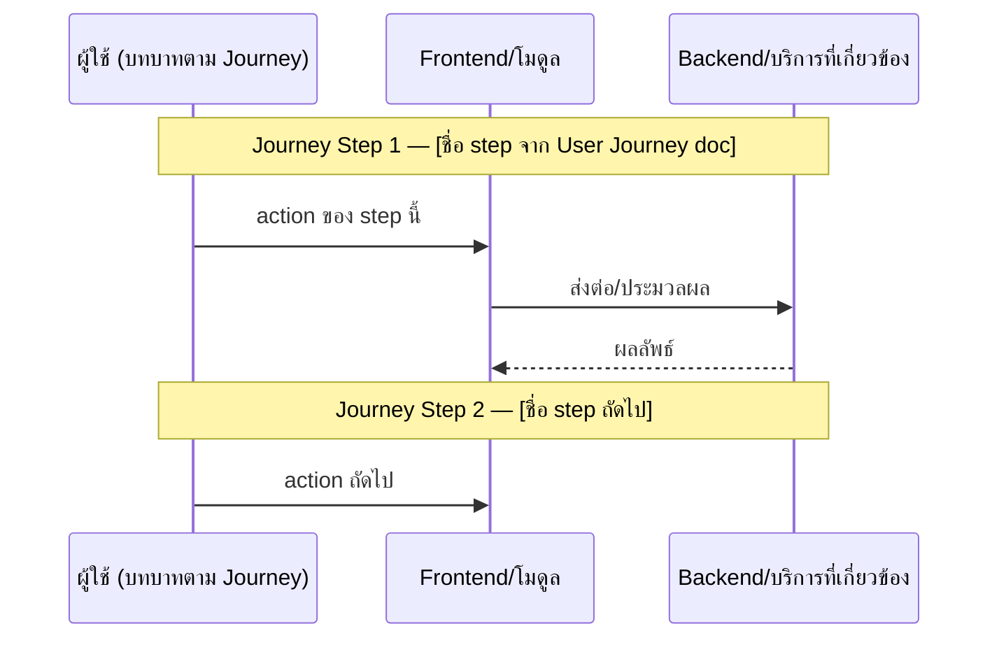

# Template — เอกสาร Architecture

ใช้เป็นโครงเริ่มต้นเวลาเขียน/แก้ `docs/02-design/02-technical/HIGH-LEVEL-ARCHITECTURE.md` (หรือไฟล์ Architecture อื่นในโฟลเดอร์เดียวกัน) — ไม่ต้องยัดทุกหัวข้อถ้า Build Plan ที่ยืนยันแล้วไม่ได้รวมหัวข้อนั้น ตัดออกได้ตามจริง

โครงนี้สรุปมาจากรูปแบบที่ `HIGH-LEVEL-ARCHITECTURE.md` ฉบับปัจจุบันของโปรเจกต์ใช้อยู่แล้ว (Current/Target State + Data Flow + ข้อจำกัด + ลำดับการสร้าง) พร้อมเพิ่มหัวข้อ Component Breakdown และ Decision Log/ADR ที่ยังไม่มีในฉบับปัจจุบัน

---

## 1. Current State (สถานะปัจจุบัน)

Diagram แบบง่าย (Mermaid `flowchart`) แสดงว่าระบบตอนนี้ทำงานยังไงจริงๆ (เช่น prototype ที่ยังไม่มี backend) — ต้องตรงกับความเป็นจริงของโค้ด ไม่ใช่ aspirational

ตามด้วยคำอธิบายสั้นๆ ว่าอะไรยังไม่มี (backend, database, auth ฯลฯ) เพื่อกันความเข้าใจผิดว่า prototype = ระบบจริง

## 2. Target State (สถานะเป้าหมาย)

Diagram ระดับ Context หรือ Container (เลือกตามที่ตกลงใน Build Plan — ดู Ambiguity Protocol ใน SKILL.md) แสดงผู้ใช้/บทบาททั้งหมด ↔ Frontend ↔ Backend/API ↔ AI services ↔ บริการภายนอก (3rd-party)

### ตาราง Layer ↔ Feature/Phase

ทุก node ในไดอะแกรมข้างบนต้องมีแถวอ้างอิงในตารางนี้ (traceability):

| Layer | องค์ประกอบ | เชื่อมโยง Feature ID / Phase |
|---|---|---|
| Users | ... | FEAT-... |
| Frontend | ... | FEAT-... |
| Backend/API | ... | FEAT-PLATFORM-... |
| AI Services | ... | FEAT-...-NN |
| External | ... | FEAT-...-NN |

## 3. Data Flow หลัก (map ตาม User Journey)

Diagram แบบ Mermaid `sequenceDiagram` ที่ **แปลงมาจากขั้นตอนจริงใน User Journey doc** ที่ยืนยันไว้ใน Build Plan (`docs/02-design/01-prototypes/USER-JOURNEY-*.md`) ไม่ใช่คิด use case ขึ้นใหม่เอง — แต่ละ step ของ journey ควรปรากฏเป็น 1 message/interaction ในไดอะแกรม เพื่อให้ผู้อ่านตาม journey ทีละ step แล้วเห็นว่าระบบ/ข้อมูลไหลยังไงในแต่ละ step นั้น

ถ้าไม่มี User Journey doc ให้ใช้ทางเลือกที่ยืนยันไว้ใน Ambiguity Protocol (เขียนจาก Feature List ตรงๆ, สร้าง Journey ก่อน, หรือทำแบบ system-to-system ล้วน) แทน — ระบุไว้ในคำอธิบายก่อน diagram ว่าใช้แนวทางไหน

ใต้ diagram ให้มีตารางเทียบ **Journey Step ↔ Diagram interaction ↔ Feature ID** เพื่อ traceability ชัดเจนว่า step ไหนของ journey ตรงกับส่วนไหนของ diagram:

| Journey Step | Interaction ใน Diagram | Feature ID |
|---|---|---|
| ... | ... | FEAT-... |

## 4. Component Breakdown (ถ้า Build Plan รวม Container/Component level)

ตารางหรือรายการอธิบายแต่ละ component/service ว่าทำหน้าที่อะไร, เชื่อมกับอะไร, และ**ไม่ผูกมัดกับ tech stack เจาะจง**เว้นแต่ Build Plan ระบุมา (ใช้คำอธิบายเชิง capability เช่น "บริการจัดเก็บไฟล์ต้นฉบับ" ไม่ใช่ "AWS S3" ถ้าไม่มีการยืนยันเทคโนโลยีจริง)

| Component | หน้าที่ | เชื่อมกับ | Feature ID |
|---|---|---|---|
| ... | ... | ... | FEAT-... |

## 5. ข้อจำกัดทางเทคนิคที่ต้องพิจารณา

รวบรวมข้อจำกัดที่ต้องรู้ก่อนสร้างจริง (เช่น ข้อจำกัดของบริการภายนอกที่ ROADMAP.md เคยเตือนไว้แล้ว, PDPA/ข้อกำหนดด้านข้อมูลสุขภาพ, quota ของ 3rd-party API) — ต้องไม่ขัดแย้งกับสิ่งที่ ROADMAP.md ระบุไว้แล้ว ถ้าพบว่าขัดแย้งให้ flag ไว้เป็น assumption/คำเตือนแทนการเงียบไว้

## 6. Decision Log / ADR (ถ้า Build Plan รวมหัวข้อนี้)

บันทึกการตัดสินใจสำคัญที่กระทบสถาปัตยกรรม แต่ละรายการควรมี:

| หัวข้อ | รายละเอียด |
|---|---|
| วันที่ | YYYY-MM-DD |
| บริบท (Context) | ปัญหา/ทางเลือกที่ต้องตัดสินใจ |
| ตัวเลือกที่พิจารณา | ระบุ ≥2 ตัวเลือกที่คิดถึง |
| ทางที่เลือก | ตัวเลือกที่เลือกและเหตุผล |
| ผลกระทบ (Consequences) | ข้อดี/ข้อเสีย/สิ่งที่ต้องแลก (trade-off) ที่ยอมรับ |

ถ้า Decision Log มีจำนวนมาก ให้พิจารณาแยกเป็นไฟล์ `docs/02-design/02-technical/ADR-{topic}.md` ต่อรายการที่สำคัญมาก แทนการยัดในไฟล์เดียว (ตามที่ตกลงใน Build Plan ข้อ "ขอบเขต Decision Log")

## 7. ลำดับการสร้างจริง

สรุปว่าควรทำอะไรก่อน-หลัง โดยอ้างอิง Phase ใน ROADMAP.md — ระบุ dependency ระหว่าง phase ให้ชัด (เช่น Phase ไหนต้องทำคู่ขนาน/ก่อน เพราะ phase อื่นพึ่งพา)

---

## หลักการเขียนที่ต้องยึดเสมอ

- **Traceability มาก่อนความสมบูรณ์แบบของ diagram** — ทุก node/component ต้องโยงกลับไป Feature ID หรือ Phase ได้ ถ้าไม่มี ID ที่ตรง ให้ตั้งชื่ออ้างอิงที่สื่อความหมายแทนการปล่อยลอย
- **Conceptual ก่อน physical เสมอเว้นแต่ระบุมา** — อย่าเลือกยี่ห้อ/เทคโนโลยีเจาะจงเองถ้า Build Plan ไม่ได้ยืนยัน ใช้คำอธิบายบทบาท/หน้าที่แทน
- **ห้ามขัดแย้งกับข้อจำกัดที่ ROADMAP.md เตือนไว้แล้ว** — อ่าน ROADMAP.md ให้ครบก่อนออกแบบ diagram ใหม่
- **Mermaid เท่านั้น ไม่พึ่งพา asset ภาพนอกไฟล์** — เพื่อให้ diagram render ได้ในทุกที่ที่เปิดไฟล์ .md (Obsidian, GitHub, editor ทั่วไป)
