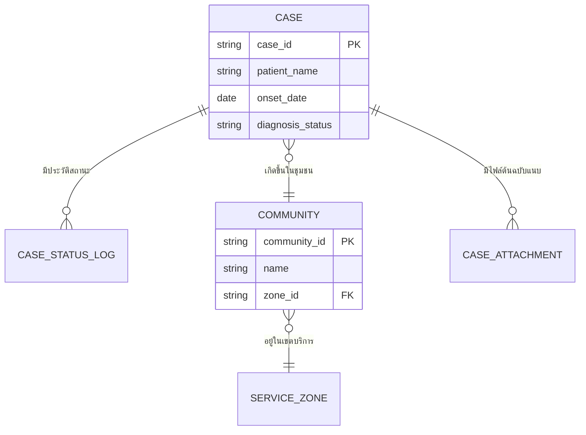

# Template — DATA-MODEL.md และ API-SPEC.md

ใช้เป็นโครงเริ่มต้นเวลาเขียน/แก้ `docs/02-design/02-technical/DATA-MODEL.md` และ `docs/02-design/02-technical/API-SPEC.md` — ทั้งคู่เป็นเอกสาร**conceptual** (ยังไม่ผูกกับ technical stack) ตัดหัวข้อที่ Build Plan ไม่รวมได้ตามจริง

---

# ส่วนที่ 1 — DATA-MODEL.md

## 1. ER Diagram

ใช้ Mermaid `erDiagram` เสมอ (render ได้ทั้ง GitHub/Obsidian/editor ทั่วไป โดยไม่ต้องพึ่ง diagram tool ภายนอก) — แสดง entity หลักทั้งหมดและความสัมพันธ์ พร้อม cardinality ที่ชัดเจน



**กติกา cardinality**: ทุกเส้นเชื่อมต้องระบุ `||`, `o{`, `}o`, `|{` ให้ตรงกับความสัมพันธ์จริงที่ยืนยันกับผู้ใช้แล้ว (ดู Ambiguity Protocol ใน SKILL.md เรื่อง 1:1 vs 1:N vs N:M) — ห้ามเดาเองถ้าไม่ชัดเจน

## 2. Entity Dictionary (รายละเอียดแต่ละตาราง)

ต่อ 1 entity ให้มีตารางแบบนี้อย่างน้อย — **conceptual type เท่านั้น** (`string`, `number`, `date`, `boolean`, `enum`, `reference`) ไม่ใช่ type เจาะจงของ database engine ใดๆ (ไม่ใช่ `VARCHAR(255)`, `TIMESTAMP`, `UUID`):

### `CASE` — เคสผู้ป่วยที่รายงานเข้าระบบ

รองรับ Feature: `FEAT-INTAKE-02`, `FEAT-DASH-*`

| Attribute | Conceptual Type | จำเป็นต้องมี | คำอธิบาย |
|---|---|---|---|
| case_id | string (PK) | ใช่ | รหัสอ้างอิงเคสหลัก ไม่ซ้ำกันในระบบ |
| patient_name | string | ใช่ | ชื่อ-สกุลผู้ป่วย |
| onset_date | date | ใช่ | วันที่เริ่มป่วยตามที่รายงาน |
| diagnosis_status | enum(รอตรวจสอบ, ยืนยันแล้ว) | ใช่ | สถานะ human-in-the-loop ก่อน auto-route |
| community_id | reference → COMMUNITY | ใช่ | ชุมชนที่เคสนี้เกิดขึ้น |

ทำแบบนี้ต่อทุก entity ที่อยู่ใน scope ของ Build Plan — ถ้า entity ไหนมี business rule พิเศษ (เช่น "แก้ไขได้เฉพาะแถวที่ยังไม่ยืนยัน" ตามที่มีอยู่แล้วใน `prototypes/v1/case-intake.js`) ให้ใส่เป็นหมายเหตุท้ายตารางของ entity นั้น

## 3. Cross-cutting concerns (ถ้า Build Plan รวมหัวข้อนี้)

- **Audit trail / versioning**: entity ไหนต้องเก็บประวัติการแก้ไข ตามที่ตกลงใน Ambiguity Protocol
- **Soft delete policy**: entity ไหนห้ามลบถาวร (มักเป็นข้อมูลสุขภาพ) ตามที่ตกลง
- **Multi-tenancy scope**: ถ้าเกี่ยวข้อง ระบุว่า entity ไหนต้องแยกตาม tenant/เทศบาลในอนาคต

---

# ส่วนที่ 2 — API-SPEC.md

## 1. หลักการ Conceptual API

ระบุ**operation** (การกระทำที่ระบบต้องรองรับ) ไม่ใช่ endpoint จริง — ยังไม่ตัดสินว่าเป็น REST/GraphQL/RPC เว้นแต่ Build Plan ยืนยันมา ใช้รูปแบบ "actor ทำอะไรกับอะไร" แทน `GET /api/v1/cases/:id`

## 2. Operation List

ต่อ 1 module ให้มีตารางแบบนี้:

### Module: Case Intake (`FEAT-INTAKE-*`)

| Operation | Actor | วัตถุประสงค์ | Input (conceptual) | Output (conceptual) |
|---|---|---|---|---|
| ดึงรายการเคสที่รอตรวจสอบ | เจ้าหน้าที่ | แสดงตาราง OCR Review | filter: สถานะ, ช่วงวันที่ | list ของ CASE ที่สถานะ = รอตรวจสอบ |
| แก้ไขข้อมูลเคสก่อนยืนยัน | เจ้าหน้าที่ | แก้ค่าที่ OCR ดึงผิด | case_id, field ที่แก้ + ค่าใหม่ | CASE ที่อัปเดตแล้ว |
| ยืนยันเคส + ส่งแจ้งเตือน | เจ้าหน้าที่ | เปลี่ยนสถานะ + trigger แจ้งเตือนทีมสอบสวนโรค | case_id | CASE สถานะ = ยืนยันแล้ว + NOTIFICATION_LOG ใหม่ |

## 3. Payload ตัวอย่าง (ถ้า Build Plan รวมระดับ field-level)

ใช้ pseudo-JSON ระบุ conceptual type เดียวกับ Entity Dictionary — ไม่ใช่ schema จริงของ framework ใดๆ:

```
CreateCaseRequest {
  patient_name: string
  onset_date: date
  community_id: reference<COMMUNITY>
}

CreateCaseResponse {
  case_id: string
  diagnosis_status: enum
}
```

## 4. Error / Validation case (ถ้า Build Plan รวมหัวข้อนี้)

ระบุ business rule ที่ต้อง validate เชิงแนวคิด (เช่น "ห้ามยืนยันเคสที่ยังไม่กรอกชุมชน") ไม่ใช่ HTTP status code เจาะจง เว้นแต่ยืนยันแล้วว่าจะใช้ REST

---

## หลักการเขียนที่ต้องยึดเสมอ (ทั้ง 2 เอกสาร)

- **Conceptual จริงๆ** — ห้ามหลุดไปใส่ syntax เฉพาะเทคโนโลยี (SQL DDL, ภาษาโปรแกรมเฉพาะ, HTTP verb เจาะจง) เว้นแต่ Build Plan ยืนยันมาแล้วว่าต้องผูกกับ stack ไหน
- **Traceability** — ทุก entity/operation ต้องระบุ Feature ID ที่รองรับ
- **สอดคล้องกับ mock data ที่มีอยู่จริงใน prototype** — ถ้า `prototypes/v1/*.js` มี field ไหนอยู่แล้ว ต้องปรากฏใน Entity Dictionary ให้ตรงกัน ไม่ขัดแย้งกันเอง (หรือระบุเป็น gap ที่ต้องเพิ่มถ้า prototype ยังไม่มี field ที่ requirement ใหม่ต้องการ)
- **Mermaid `erDiagram` เท่านั้นสำหรับ ER Diagram** — ไม่พึ่งพา diagram tool ภายนอกที่ต้อง export ภาพ
