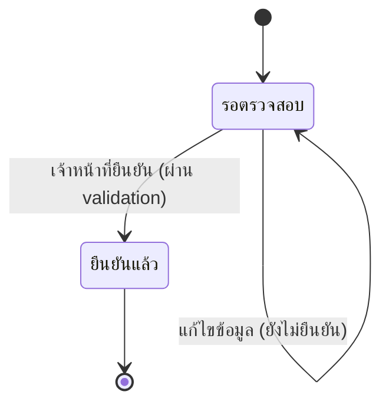

# Template — เอกสาร Detailed Design

ใช้เป็นโครงเริ่มต้นเวลาเขียน/แก้ `docs/02-design/02-technical/DETAILED-DESIGN.md` (หรือไฟล์แยกต่อโมดูลถ้า Build Plan ตกลงแบบนั้น) — ไม่ต้องยัดทุกหัวข้อถ้า Build Plan ที่ยืนยันแล้วไม่ได้รวมหัวข้อนั้น ตัดออกได้ตามจริง เว้นแต่หัวข้อ 2 (Sequence Flow) ที่**ต้องมีเสมอ**ต่อ 1 flow ในสโคป

โครงสร้างไฟล์: 1 ส่วนหลักต่อ 1 feature/flow ที่อยู่ใน scope เรียงตาม Feature ID หรือลำดับ journey ที่ตกลงไว้ใน Build Plan

---

## [ชื่อ Flow] — `FEAT-<โมดูล>-NN`

### 1. Flow Overview

สรุปสั้นๆ ก่อนลง diagram:

| หัวข้อ | รายละเอียด |
|---|---|
| Trigger | อะไรเริ่ม flow นี้ (action ของผู้ใช้ / เวลาที่กำหนด / event จากระบบอื่น) |
| Actor หลัก | ใครทำ/ใครได้รับผล |
| Precondition | เงื่อนไขที่ต้องเป็นจริงก่อน flow นี้เริ่มได้ |
| Postcondition | สถานะของระบบ/ข้อมูลหลัง flow นี้เสร็จสมบูรณ์ |
| Reference | Journey step ไหน (ถ้ายึด journey เป็นแกน), Operation ไหนจาก `API-SPEC.md` (ถ้ายึด operation เป็นแกน), Entity ไหนจาก `DATA-MODEL.md` ที่เกี่ยวข้อง, Component ไหนจาก `HIGH-LEVEL-ARCHITECTURE.md` |

### 2. Sequence Flow (บังคับมีเสมอ)

Mermaid `sequenceDiagram` ที่ขยายรายละเอียด**ภายใน** 1 journey step หรือ 1 operation ให้เห็น decision point/validation/error handling ที่ diagram หัวข้อ 3 ของ `HIGH-LEVEL-ARCHITECTURE.md` ไม่ได้ลงรายละเอียดถึง — ใช้ `alt`/`opt`/`loop` ของ Mermaid แทน branch ทางเลือก/การวนซ้ำ (เช่น retry) จริง ไม่ใช่แค่ note บรรยาย

```mermaid
sequenceDiagram
  participant Actor as [Actor หลัก]
  participant Comp as [Component ที่รับผิดชอบ — อ้างจาก HIGH-LEVEL-ARCHITECTURE.md ถ้ามี]
  participant Data as [Entity/Operation ที่เกี่ยวข้อง — อ้างจาก DATA-MODEL.md/API-SPEC.md ถ้ามี]

  Actor->>Comp: [action เริ่ม flow]
  Comp->>Comp: [validation/business rule ที่ต้องเช็คก่อนไปต่อ]
  alt เงื่อนไขผ่าน
    Comp->>Data: [เขียน/อ่านข้อมูล]
    Data-->>Comp: [ผลลัพธ์]
    Comp-->>Actor: [ผลลัพธ์สำเร็จ]
  else เงื่อนไขไม่ผ่าน
    Comp-->>Actor: [ข้อความ/สถานะข้อผิดพลาด]
  end
```

**กติกา**: ทุก decision point ในไดอะแกรมต้องมาจาก business rule ที่ระบุไว้จริงในหัวข้อ 3 (ไม่คิดขึ้นใหม่เอง) — ถ้า business rule ยังไม่ชัดเจน ต้องเป็นจุดที่ผ่าน Ambiguity Protocol มาแล้วใน Build Plan

### 3. State / Status Diagram (ถ้า Build Plan รวมหัวข้อนี้สำหรับ flow นี้)

ใช้เมื่อ entity ที่เกี่ยวข้องมี lifecycle/สถานะหลายขั้น (เช่นสถานะเคส, สถานะงานพ่น) — Mermaid `stateDiagram-v2`:



ต้องสอดคล้องกับสถานะที่ระบุไว้ใน Entity Dictionary ของ `DATA-MODEL.md` (ถ้ามี field ประเภท `enum` ที่เป็นสถานะของ entity นี้อยู่แล้ว) — ห้ามคิดสถานะใหม่ที่ขัดกับ enum เดิมโดยไม่ flag เป็น gap

### 4. Business Rule / Validation Logic

ตารางสรุป rule ที่ปรากฏในหัวข้อ 2 แบบเห็นภาพ (ไม่ต้องอ่านทั้ง diagram ซ้ำ):

| Rule | เงื่อนไข | ผลถ้าไม่ผ่าน | Feature ID |
|---|---|---|---|
| ... | ... | ... | FEAT-... |

### 5. Error & Exception Handling (ตามขอบเขตที่ตกลงใน Build Plan)

| กรณี | จุดที่เกิด (อ้างจาก step ใน diagram) | การจัดการ | ผลกระทบต่อผู้ใช้/ข้อมูล |
|---|---|---|---|
| ... | ... | ... | ... |

### 6. Traceability

| อ้างอิง | ID/ชื่อ |
|---|---|
| Feature | FEAT-... |
| Journey Step (ถ้ามี) | USER-JOURNEY-...#step-N |
| Entity ที่เกี่ยวข้อง (ถ้ามี) | จาก DATA-MODEL.md |
| Operation ที่เกี่ยวข้อง (ถ้ามี) | จาก API-SPEC.md |
| Component ที่เกี่ยวข้อง (ถ้ามี) | จาก HIGH-LEVEL-ARCHITECTURE.md |

---

ทำหัวข้อ 1-6 (เท่าที่ Build Plan รวมไว้) ซ้ำต่อทุก flow ที่อยู่ใน scope

## หลักการเขียนที่ต้องยึดเสมอ

- **Sequence Flow ต้องมีเสมอ ต่อ 1 flow** — เป็นหัวข้อเดียวที่ไม่สามารถตัดออกจาก Build Plan ได้
- **ขยายรายละเอียด ไม่ใช่ซ้ำของเดิม** — ถ้า `HIGH-LEVEL-ARCHITECTURE.md` มี message เดียวสำหรับ step นี้อยู่แล้ว หัวข้อ 2 ต้องแตกบรรทัดนั้นให้ละเอียดขึ้น ไม่ใช่ copy diagram เดิมมาวาง
- **Conceptual ก่อน physical เสมอเว้นแต่ระบุมา** — ห้ามเลือกยี่ห้อ/เทคโนโลยีเจาะจงเอง (ภาษา, message queue, retry library) ใช้คำอธิบายเชิงบทบาท/หน้าที่แทน
- **Traceability มาก่อนความสมบูรณ์แบบของ diagram** — ทุก flow ต้องโยงกลับไป Feature ID ได้ และควรโยงไปยัง entity/operation/component ที่มีอยู่แล้วถ้ามี
- **ห้ามขัดแย้งกับ business rule ที่ ROADMAP.md/DATA-MODEL.md/API-SPEC.md ระบุไว้แล้ว** — อ่านให้ครบก่อนออกแบบ diagram ใหม่
- **Mermaid เท่านั้น** — ห้ามอ้างอิงไฟล์ภาพนอก .md หรือใช้ diagram tool ที่ต้อง render แยก เพื่อให้เปิดดูได้ในทุก editor/Obsidian/GitHub
