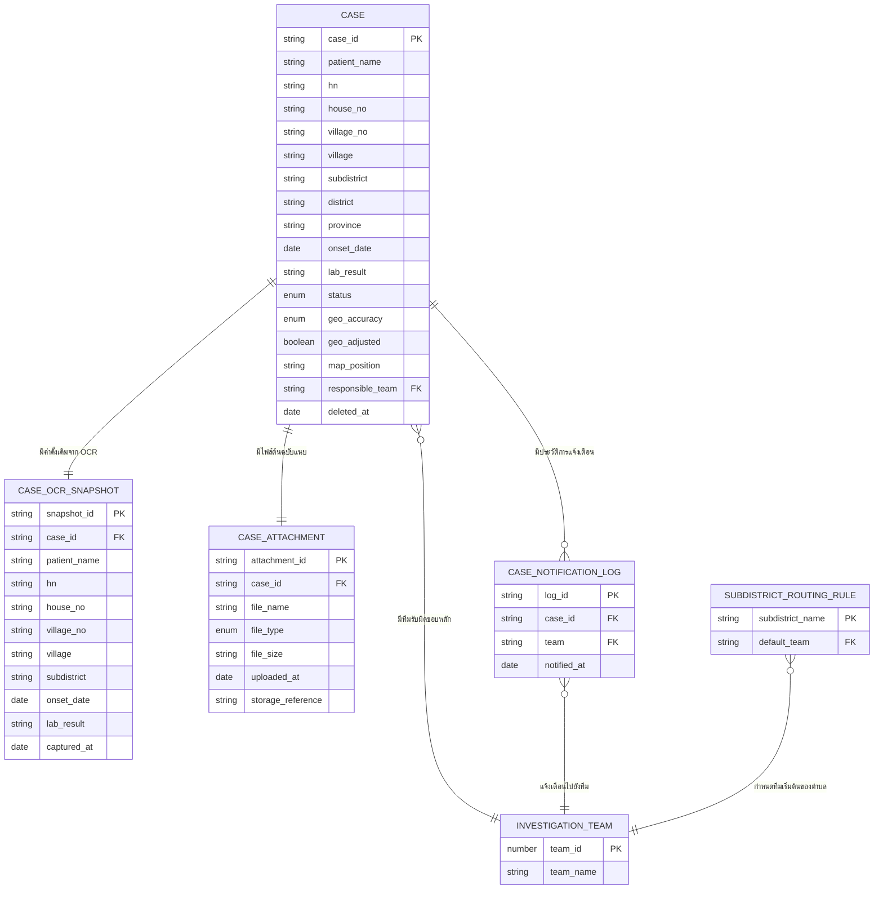

# Data Model — Case Intake (`FEAT-INTAKE-*`)

เอกสารนี้เป็น**conceptual data model เท่านั้น** — ยังไม่ผูกกับ database engine, ภาษาโปรแกรม หรือ framework ใดๆ (ยังไม่มีการยืนยันเทคโนโลยีมาในรอบนี้) ตามโครงจาก skill `data-contract-builder` (`references/data-contract-templates.md`)

ขอบเขต: เฉพาะโมดูล Case Intake (`FEAT-INTAKE-01` ถึง `FEAT-INTAKE-09` ตาม [[../../01-requirements/01-spec/FEATURE-LIST|FEATURE-LIST.md]]) อ้างอิง mock data จริงใน `prototypes/v1/case-intake.js` เป็นฐาน — feature ที่ยังเป็น backlog (`FEAT-INTAKE-05` ถึง `FEAT-INTAKE-09`) ออกแบบ schema ให้พอ "รองรับได้" แต่ไม่ลงรายละเอียดการเชื่อมต่อ 3rd-party API จริง

## 1. ER Diagram

**หมายเหตุ cardinality ที่ยืนยันแล้วกับผู้ใช้ (Ambiguity Protocol):**

- `CASE` ↔ `CASE_ATTACHMENT` = **1:1** — 1 เคสมีไฟล์ต้นฉบับแนบได้ 1 ไฟล์เท่านั้นในรอบนี้ ตรงกับ mock ปัจจุบันที่มี field ไฟล์ฝังอยู่ระดับเคสเดียว (ไม่ใช่ list)
- `CASE` ↔ `CASE_OCR_SNAPSHOT` = **1:1** — capture ค่า OCR ดั้งเดิมครั้งเดียวตอน OCR เสร็จ, immutable, ใช้ diff กับค่าปัจจุบันใน `CASE`
- `CASE` ↔ `INVESTIGATION_TEAM` (ผ่าน `responsible_team`) = **N:1** — 1 เคสมีทีมรับผิดชอบหลักทีมเดียว ณ เวลาใดเวลาหนึ่ง (ไม่ผูกหลายทีมพร้อมกัน)
- `CASE` ↔ `CASE_NOTIFICATION_LOG` = **1:N** — แยก concept "ประวัติการแจ้งเตือน" ออกจาก "ทีมรับผิดชอบปัจจุบัน" เพื่อรองรับกรณีแจ้งเตือนซ้ำในอนาคต (ปัจจุบัน prototype ยืนยันได้ครั้งเดียวต่อเคส จึงมี log ไม่เกิน 1 รายการต่อเคสในทางปฏิบัติ แต่ schema ไม่ได้ล็อกไว้แค่ 1 รายการ)

## 2. Entity Dictionary

### `CASE` — เคสผู้ป่วยที่รายงานเข้าระบบ (ข้อมูลปัจจุบัน/effective)

รองรับ Feature: `FEAT-INTAKE-01`, `FEAT-INTAKE-02`, `FEAT-INTAKE-03`, `FEAT-INTAKE-04`, `FEAT-INTAKE-07` (backlog — geo field), `FEAT-INTAKE-09` (backlog — unlock, ยังไม่รองรับในรอบนี้)

| Attribute | Conceptual Type | จำเป็นต้องมี | คำอธิบาย |
|---|---|---|---|
| case_id | string (PK) | ใช่ | รหัสอ้างอิงเคสหลัก ไม่ซ้ำกันในระบบ |
| patient_name | string | ใช่ | ชื่อ-สกุลผู้ป่วย — แก้ไขได้ก่อนยืนยัน |
| hn | string | ใช่ | Hospital Number — แก้ไขได้ก่อนยืนยัน |
| house_no | string | ใช่ | บ้านเลขที่ — แก้ไขได้ก่อนยืนยัน |
| village_no | string | ใช่ | หมู่ที่ — แก้ไขได้ก่อนยืนยัน |
| village | string | ใช่ | ชื่อหมู่บ้าน — แก้ไขได้ก่อนยืนยัน |
| subdistrict | string | ใช่ | ตำบล — แก้ไขได้ก่อนยืนยัน, การแก้ไขค่านี้ trigger auto-route `responsible_team` (ดู `SUBDISTRICT_ROUTING_RULE`) |
| district | string | ใช่ | อำเภอ — **ไม่อยู่ในรายการฟิลด์ที่แก้ไขได้ผ่าน OCR Review ในรอบนี้** (ตรงกับ `saveEdit()` ของ prototype ปัจจุบันที่ไม่รวม `district`) |
| province | string | ใช่ | จังหวัด — เช่นเดียวกับ `district`, ไม่อยู่ในรายการฟิลด์ที่แก้ไขได้รอบนี้ |
| onset_date | date | ใช่ | วันที่เริ่มป่วยตามที่รายงาน — แก้ไขได้ก่อนยืนยัน |
| lab_result | string | ใช่ | ผลตรวจทางห้องปฏิบัติการ/คลินิก — แก้ไขได้ก่อนยืนยัน |
| status | enum(รอตรวจสอบ, ยืนยันแล้ว) | ใช่ | สถานะ human-in-the-loop — เปลี่ยนได้ทางเดียวจาก "รอตรวจสอบ" → "ยืนยันแล้ว" เท่านั้นในรอบนี้ (ไม่มี state สำหรับ unlock แก้ไขซ้ำ ตาม `FEAT-INTAKE-09` ที่ยังเป็น backlog) |
| geo_accuracy | enum(high, low) | ใช่ | ระดับความแม่นยำของพิกัดที่ได้มา (mock ปัจจุบันสุ่มค่า, ของจริงจะมาจาก Geocoding API ตาม `FEAT-INTAKE-07`) |
| geo_adjusted | boolean | ใช่ | ปรับพิกัดด้วยมือแล้วหรือยัง — มีผลเฉพาะกรณี `geo_accuracy = low` เป็น fallback ตามที่ ROADMAP.md ระบุ |
| map_position | string (conceptual) | ใช่ | ตำแหน่งสำหรับวาดหมุดบน Spot Map — เป็นค่าจำลองสำหรับ layout ในรอบนี้ ไม่ใช่พิกัดภูมิศาสตร์จริง (lat/long) จนกว่า `FEAT-INTAKE-07` จะเชื่อมต่อจริง |
| responsible_team | reference → `INVESTIGATION_TEAM` | ใช่ | ทีมสอบสวนโรคที่รับผิดชอบเคสนี้ ณ ปัจจุบัน — auto-reassign ได้ตอนแก้ `subdistrict` |
| deleted_at | date (nullable) | ไม่บังคับ (null = ยังไม่ถูกลบ) | soft delete marker — ดูหัวข้อ Cross-cutting concerns |

**Business rule เพิ่มเติม**: แก้ไขข้อมูลได้เฉพาะเคสที่ `status = รอตรวจสอบ` เท่านั้น (ตรงกับ `startEdit()` ใน prototype ที่ปฏิเสธแถวที่ `confirmed`) — เคสที่ยืนยันแล้วต้องรอ `FEAT-INTAKE-09` (unlock flow, ยังไม่ทำ) ก่อนจะแก้ไขซ้ำได้

### `CASE_OCR_SNAPSHOT` — ค่าที่ OCR ดึงได้ตอนแรก (immutable audit baseline)

รองรับ Feature: `FEAT-INTAKE-02` (ฐานสำหรับ diff ตอน human-in-the-loop), `FEAT-INTAKE-05` (backlog — วัดความแม่นยำ OCR จริงในอนาคต)

| Attribute | Conceptual Type | จำเป็นต้องมี | คำอธิบาย |
|---|---|---|---|
| snapshot_id | string (PK) | ใช่ | รหัสอ้างอิง snapshot |
| case_id | reference → `CASE` (unique) | ใช่ | เคสที่ snapshot นี้เป็นของ — 1:1 กับ CASE |
| patient_name | string | ใช่ | ค่าดั้งเดิมจาก OCR (ก่อนแก้ไขใดๆ) |
| hn | string | ใช่ | ค่าดั้งเดิมจาก OCR |
| house_no | string | ใช่ | ค่าดั้งเดิมจาก OCR |
| village_no | string | ใช่ | ค่าดั้งเดิมจาก OCR |
| village | string | ใช่ | ค่าดั้งเดิมจาก OCR |
| subdistrict | string | ใช่ | ค่าดั้งเดิมจาก OCR |
| onset_date | date | ใช่ | ค่าดั้งเดิมจาก OCR |
| lab_result | string | ใช่ | ค่าดั้งเดิมจาก OCR |
| captured_at | date | ใช่ | เวลาที่ OCR extraction เสร็จ (ครั้งเดียว, immutable) |

**หมายเหตุ**: mirror เฉพาะ field ที่แก้ไขได้ใน `CASE` เท่านั้น (ไม่รวม `district`/`province` เพราะไม่อยู่ในรายการฟิลด์ที่แก้ไขได้ — จึงไม่จำเป็นต้องเก็บค่าดั้งเดิมไว้ diff) — เป็น audit trail แบบ "ต้นฉบับคู่กับค่าที่แก้แล้ว" ตามที่ยืนยันในแผน ไม่ใช่ full version history ทุกครั้งที่แก้

### `CASE_ATTACHMENT` — ไฟล์ต้นฉบับที่แนบมากับเคส

รองรับ Feature: `FEAT-INTAKE-01`, `FEAT-INTAKE-06` (backlog — เก็บจริงใน Google Drive)

| Attribute | Conceptual Type | จำเป็นต้องมี | คำอธิบาย |
|---|---|---|---|
| attachment_id | string (PK) | ใช่ | รหัสอ้างอิงไฟล์แนบ |
| case_id | reference → `CASE` (unique) | ใช่ | เคสที่ไฟล์นี้เป็นของ — 1:1 กับ CASE ในรอบนี้ |
| file_name | string | ใช่ | ชื่อไฟล์ต้นฉบับ |
| file_type | enum(PDF, JPEG) | ใช่ | ประเภทไฟล์ที่อัปโหลด |
| file_size | string | ใช่ | ขนาดไฟล์แบบแสดงผล (เช่น "842 KB") |
| uploaded_at | date | ใช่ | เวลาที่อัปโหลด |
| storage_reference | string (conceptual) | ใช่ | ที่อยู่อ้างอิงของไฟล์ในระบบจัดเก็บ — รอบนี้เป็น concept กลางๆ เท่านั้น ไม่ได้ออกแบบผูกกับ Google Drive API จริงตาม `FEAT-INTAKE-06` |

### `INVESTIGATION_TEAM` — ทีมสอบสวนโรคตามเขตพื้นที่ (lookup)

รองรับ Feature: `FEAT-INTAKE-03`

| Attribute | Conceptual Type | จำเป็นต้องมี | คำอธิบาย |
|---|---|---|---|
| team_id | number (PK) | ใช่ | รหัสทีม — 5 รายการคงที่ตาม mock (`TEAMS[1..5]`) |
| team_name | string | ใช่ | ชื่อทีม เช่น "ทีมสอบสวนโรค เขต 1" |

### `SUBDISTRICT_ROUTING_RULE` — กฎ auto-route ตำบล → ทีมเริ่มต้น (lookup)

รองรับ Feature: `FEAT-INTAKE-02` (ใช้ตอนแก้ไขและบันทึก), `FEAT-INTAKE-03`

| Attribute | Conceptual Type | จำเป็นต้องมี | คำอธิบาย |
|---|---|---|---|
| subdistrict_name | string (PK) | ใช่ | ชื่อตำบลที่ระบบรู้จักล่วงหน้า (mock ปัจจุบันมี 6 รายการ) |
| default_team | reference → `INVESTIGATION_TEAM` | ใช่ | ทีมที่ควรรับผิดชอบตำบลนี้เป็นค่าเริ่มต้น |

**Business rule สำคัญ**: กฎนี้ครอบคลุมเฉพาะตำบลที่มีอยู่ใน rule set เท่านั้น — ถ้าผู้ใช้แก้ไข `subdistrict` ของเคสเป็นชื่อตำบลที่**ไม่ตรง**กับ `subdistrict_name` ใดใน entity นี้ ระบบจะ**ไม่เปลี่ยน** `responsible_team` เดิมของเคสนั้น (คงค่าก่อนแก้ไขไว้) — ตรงกับ behavior ของ `SUBDISTRICT_TEAM_MAP` ใน `prototypes/v1/case-intake.js` ทุกประการ

### `CASE_NOTIFICATION_LOG` — ประวัติการแจ้งเตือนทีมสอบสวนโรค

รองรับ Feature: `FEAT-INTAKE-03`, `FEAT-INTAKE-08` (backlog — ช่องทางแจ้งเตือนจริงผ่าน LINE OA)

| Attribute | Conceptual Type | จำเป็นต้องมี | คำอธิบาย |
|---|---|---|---|
| log_id | string (PK) | ใช่ | รหัสอ้างอิง log entry |
| case_id | reference → `CASE` | ใช่ | เคสที่ถูกแจ้งเตือน |
| team | reference → `INVESTIGATION_TEAM` | ใช่ | ทีมที่ได้รับแจ้งเตือน ณ เวลานั้น |
| notified_at | date | ใช่ | เวลาที่ส่งแจ้งเตือน |

**หมายเหตุ**: entity นี้เก็บเฉพาะ reference ไปยัง `CASE`/`INVESTIGATION_TEAM` + เวลา ไม่ denormalize ชื่อผู้ป่วย/ตำบลไว้ในตัวเอง (ต่างจาก mock `NOTIFICATIONS[]` ที่เก็บ `patientName`/`subdistrict` แบบ snapshot ไว้ตรงๆ เพื่อความสะดวกในการ render) — ข้อมูลแสดงผลเหล่านั้นต้องดึงผ่าน `case_id` ตอน query แทน ดู "Assumption" ท้ายผลลัพธ์

## 3. Cross-cutting concerns

- **Audit trail**: เก็บค่า OCR ดั้งเดิมคู่กับค่าปัจจุบันแบบ "ต้นฉบับ 1 ครั้ง vs ค่าที่แก้ไขแล้ว" ผ่าน `CASE_OCR_SNAPSHOT` (immutable, capture ครั้งเดียวตอน OCR เสร็จ) — ไม่ใช่ full version history ทุกครั้งที่แก้ไข ตามที่ยืนยันใน Ambiguity Protocol
- **Soft delete policy**: Soft delete เสมอ ไม่มี hard delete operation ในเอกสารนี้ — `CASE`, `CASE_OCR_SNAPSHOT`, `CASE_ATTACHMENT`, `CASE_NOTIFICATION_LOG` (ข้อมูลที่ผูกกับ lifecycle ของเคสสุขภาพโดยตรง) ต้องมี field แบบ `deleted_at` เพื่อทำเครื่องหมายว่าถูกลบแทนการลบถาวร entity lookup (`INVESTIGATION_TEAM`, `SUBDISTRICT_ROUTING_RULE`) เป็น master data ที่มี lifecycle ของตัวเอง ไม่ได้ระบุ soft delete ไว้ในตารางด้านบนเพื่อไม่ scope creep — ถือเป็น assumption ที่ระบุไว้ท้ายผลลัพธ์
- **Multi-tenancy**: ไม่อยู่ใน scope ของ Build Plan รอบนี้ ไม่ได้ระบุไว้ในเอกสารนี้
