# Detailed Design — AI-DSRP (ทั้งระบบ 8 โมดูล)

เอกสารนี้เป็น**conceptual detailed design** — ขยายรายละเอียด*ภายใน* 1 journey step (โมดูล Dashboard) หรือ 1 operation (อีก 7 โมดูล) ที่มีอยู่แล้วใน [[./HIGH-LEVEL-ARCHITECTURE|HIGH-LEVEL-ARCHITECTURE.md]]/[[../01-prototypes/USER-JOURNEY-outbreak-dashboard|USER-JOURNEY-outbreak-dashboard.md]] ให้เห็น decision point/validation/error handling ที่ไดอะแกรมหยาบเดิมไม่ได้ลงถึง — ไม่ใช่การคัดลอก diagram เดิมมาวางซ้ำ ตามโครงจาก skill `detailed-design-builder` (`references/detailed-design-template.md`)

ขอบเขต: ครอบคลุมทั้ง 8 โมดูล — Feature ID อ้างจาก [[../../01-requirements/01-spec/FEATURE-LIST|FEATURE-LIST.md]], entity จาก [[./DATA-MODEL|DATA-MODEL.md]], operation จาก [[./API-SPEC|API-SPEC.md]]

## 0. หลักการอ่านเอกสารนี้ (ยืนยันแล้วใน Build Plan)

- **ระดับความละเอียด Sequence Flow**: ทุก flow เป็น **coarse** (decision point หลัก + ผลสำเร็จ/ไม่สำเร็จ 2 ทาง) ยกเว้น **4 flow เสี่ยงสูง** ที่ทำแบบ **step-by-step ละเอียด** (มี validation/error/retry branch เต็ม): OCR Review & Confirm Flow, Case Clustering Confirm & Report Flow, Control Plan Approval Flow, Alert Assign & Close Flow
- **State/Status Diagram**: ส่วนใหญ่ไม่ทำแยก (ALERT/TEAM มี 3 สถานะ, CASE/CASE_CLUSTER มี 2 สถานะ — ใช้ `Note` ใน sequence diagram แทน) **ยกเว้น `APPROVAL_REQUEST`** ที่ข้าม threshold ≥4 สถานะจริงหลังเพิ่ม `rejected` (draft/sent/approved/rejected) — มี `stateDiagram-v2` แยกใน Flow 8 (ดูด้านล่าง)
- **Error & Exception Handling** ครอบเฉพาะ error ที่กระทบ business-critical/ข้อมูลสุขภาพ: **เคสซ้ำ, cluster ผิดพื้นที่, แจ้งเตือนผิดทีม, อนุมัติซ้ำซ้อน, ปิด alert โดยไม่มี note** — flow ที่ไม่มี error ประเภทนี้เกี่ยวข้องจะระบุไว้ชัดเจนว่า "ไม่มี" แทนการยัดตารางที่ไม่จำเป็น ไม่ครอบ error ทั่วไป (network fail, timeout ฯลฯ)
- **Tech Stack**: [[./TECH-STACK|TECH-STACK.md]] ยืนยัน Frontend (Vanilla JS + Node.js/EJS partials), Backend/API runtime (Node.js + Express/Fastify), **OCR/Document AI vendor (Claude Vision — Anthropic, ยืนยัน 2026-09-08)**, **Geocoding vendor (Google Maps Geocoding API, ยืนยัน 2026-09-08)** — จึง participant ที่เกี่ยวข้องใน Flow 1/Flow 2 ด้านล่างอ้างชื่อ vendor จริงแล้ว ส่วน component อื่นที่ flow อื่นในไฟล์นี้เรียกใช้ (Case Clustering, AI Vision QC) **ยังไม่ยืนยัน vendor จริง** จึง participant ยังเป็นชื่อ capability-level ตาม `HIGH-LEVEL-ARCHITECTURE.md` หัวข้อ 6 เหมือนเดิม (mixed state ตามปกติของเอกสารนี้)
- **แกนอ้างอิงหลัก**: Dashboard ยึด [[../01-prototypes/USER-JOURNEY-outbreak-dashboard|USER-JOURNEY-outbreak-dashboard.md]] เป็นแกน — อีก 7 โมดูลยึด operation ใน `API-SPEC.md` เป็นแกน
- Diagram ส่วนใหญ่ใช้ `sequenceDiagram` (Mermaid) — มี `stateDiagram-v2` เพิ่ม 1 diagram เฉพาะ Flow 8 (`APPROVAL_REQUEST`) ตามเหตุผลข้างต้น

---

# โมดูล: Case Intake (`FEAT-INTAKE-*`)

## Flow 1 — OCR Review & Confirm Flow (step-by-step ละเอียด) — `FEAT-INTAKE-01`/`02`/`03`/`05`

### 1. Flow Overview

| หัวข้อ | รายละเอียด |
|---|---|
| Trigger | เจ้าหน้าที่ รพ./เทศบาล อัปโหลดไฟล์รายงานเคส (PDF/JPEG) |
| Actor หลัก | เจ้าหน้าที่ รพ./เทศบาล (อัปโหลด/ตรวจสอบ/ยืนยัน), ระบบ (OCR extraction, auto-route ทีม) |
| Precondition | ไฟล์รายงานเคสอยู่ในรูปแบบ PDF/JPEG ที่ระบบรองรับ |
| Postcondition | `CASE.status = ยืนยันแล้ว`, มี `CASE_NOTIFICATION_LOG` ใหม่, `responsible_team` ถูกกำหนดแล้ว |
| Reference | Operation 1, 2, 3, 5, 6 (`API-SPEC.md` หัวข้อ 2) · Entity `CASE`/`CASE_OCR_SNAPSHOT`/`CASE_ATTACHMENT`/`CASE_NOTIFICATION_LOG`/`TEAM`/`SUBDISTRICT_ROUTING_RULE` (`DATA-MODEL.md`) · Component "บริการ OCR/Document AI (Claude Vision)", "Web App (Frontend)", "API Server" (`HIGH-LEVEL-ARCHITECTURE.md` หัวข้อ 6) |

### 2. Sequence Flow

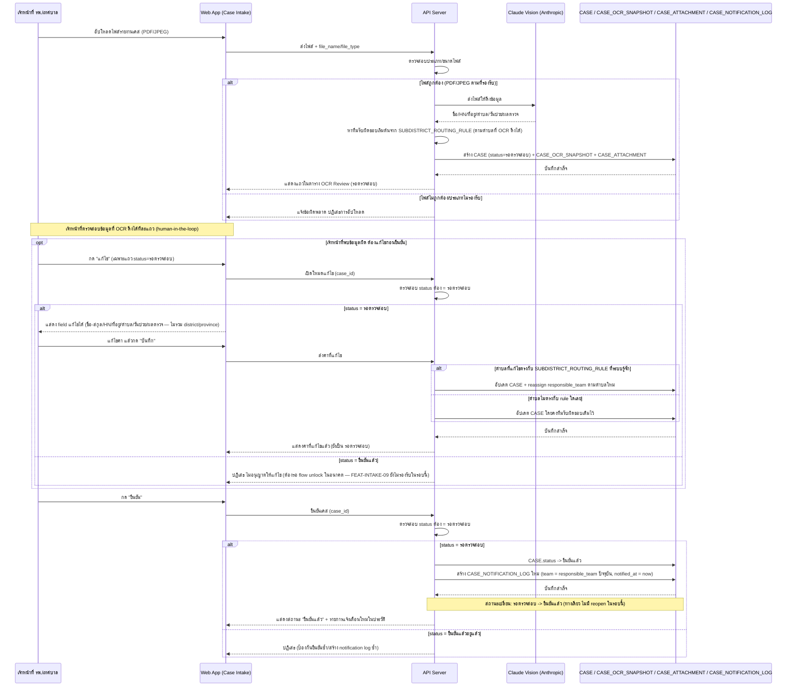

### 3. Business Rule / Validation Logic

| Rule | เงื่อนไข | ผลถ้าไม่ผ่าน | Feature ID |
|---|---|---|---|
| แก้ไขข้อมูลได้เฉพาะเคสที่ยังไม่ยืนยัน | `CASE.status = รอตรวจสอบ` | ปฏิเสธการแก้ไข | FEAT-INTAKE-02 |
| `district`/`province` ไม่อยู่ในฟิลด์ที่แก้ไขได้ | เสมอ | ไม่มีช่องให้แก้ในรอบนี้ | FEAT-INTAKE-02 |
| Auto-route ทีมรับผิดชอบตอนแก้ไขตำบล | ตำบลที่แก้ตรงกับ `SUBDISTRICT_ROUTING_RULE` | reassign `responsible_team`; ถ้าไม่ตรง คงทีมเดิม | FEAT-INTAKE-02, FEAT-INTAKE-03 |
| ยืนยันเคสได้ครั้งเดียว | `CASE.status = รอตรวจสอบ` ก่อนยืนยัน | ปฏิเสธ ป้องกันยืนยันซ้ำ | FEAT-INTAKE-02 |
| ยืนยันเคสสร้าง notification log ใหม่เสมอ | ทุกครั้งที่ยืนยันสำเร็จ | ส่งไปยัง `responsible_team` ปัจจุบัน | FEAT-INTAKE-03 |

### 4. Error & Exception Handling

| กรณี | จุดที่เกิด (อ้างจาก step ใน diagram) | การจัดการ | ผลกระทบต่อผู้ใช้/ข้อมูล |
|---|---|---|---|
| เคสซ้ำ | ตอนอัปโหลดไฟล์/สร้าง `CASE` ใหม่ | **ไม่มี dedup rule ที่ยืนยันในแผนรอบนี้** — ระบบไม่ตรวจสอบไฟล์/HN ซ้ำอัตโนมัติ (เช่น อัปโหลดไฟล์เดิมซ้ำสองครั้ง) — ถือเป็น **gap** ที่ต้องยืนยันเพิ่มก่อน implement จริง | อาจเกิดเคสซ้ำในระบบ ต้องตรวจด้วยมือ |
| แจ้งเตือนผิดทีม | ตอนยืนยันเคส (สร้าง `CASE_NOTIFICATION_LOG`) | ระบบส่งแจ้งเตือนไปยัง `responsible_team` ตามที่ auto-route ไว้ล่าสุดเสมอ — ถ้าตำบลที่ป้อนผิดและไม่ตรง `SUBDISTRICT_ROUTING_RULE` ระบบจะคงทีมเดิมไว้แบบเงียบ (silent no-op) โดยไม่มีการเตือนผู้ใช้ชัดเจนว่าทีมไม่ถูก reassign — ถือเป็น **risk ที่ flag ไว้**: UI ควรแสดงข้อความยืนยันชัดเจนตอนแก้ไขว่าทีมเปลี่ยน/ไม่เปลี่ยน | เคสอาจถูกแจ้งเตือนไปยังทีมที่ไม่ตรงพื้นที่จริง |

### 5. Traceability

| อ้างอิง | ID/ชื่อ |
|---|---|
| Feature | FEAT-INTAKE-01, FEAT-INTAKE-02, FEAT-INTAKE-03, FEAT-INTAKE-05 (backlog), FEAT-INTAKE-08 (backlog), FEAT-INTAKE-09 (backlog) |
| Entity | `CASE`, `CASE_OCR_SNAPSHOT`, `CASE_ATTACHMENT`, `CASE_NOTIFICATION_LOG`, `TEAM`, `SUBDISTRICT_ROUTING_RULE` |
| Operation | API-SPEC.md operation 1, 2, 3, 5, 6 |
| Component | Web App (Case Intake), API Server, บริการ OCR/Document AI (Claude Vision), LINE OA (backlog) |

---

## Flow 2 — Manual Geo Adjustment (coarse) — `FEAT-INTAKE-04`

### 1. Flow Overview

| หัวข้อ | รายละเอียด |
|---|---|
| Trigger | เจ้าหน้าที่เห็นเคสที่ `geo_accuracy = low` และต้องการปรับพิกัดด้วยมือ (fallback) |
| Actor หลัก | เจ้าหน้าที่ รพ./เทศบาล |
| Precondition | เคสมี `geo_accuracy = low` |
| Postcondition | `CASE.geo_adjusted` ถูกสลับค่า (toggle) |
| Reference | Operation 4 (`API-SPEC.md`) · Entity `CASE` (`geo_accuracy`, `geo_adjusted`) · Component Web App (Case Intake), API Server, บริการ Geocoding (Google Maps Geocoding API) |

### 2. Sequence Flow

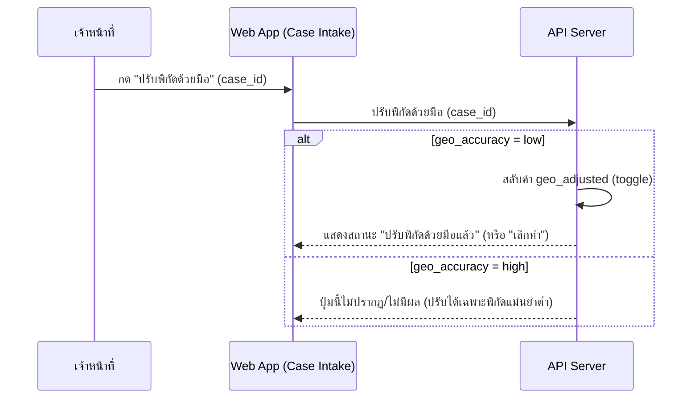

### 3. Business Rule / Validation Logic

| Rule | เงื่อนไข | ผลถ้าไม่ผ่าน | Feature ID |
|---|---|---|---|
| ปรับพิกัดมีผลเฉพาะพิกัดแม่นยำต่ำ | `geo_accuracy = low` | ปุ่มไม่ทำงาน/ไม่ปรากฏเมื่อ `geo_accuracy = high` | FEAT-INTAKE-04 |

### 4. Error & Exception Handling

ไม่มี error ระดับ business-critical เฉพาะสำหรับ flow นี้ตามขอบเขตที่ยืนยันใน Build Plan (ครอบเฉพาะ 5 ประเภทที่ระบุในหัวข้อ 0)

### 5. Traceability

| อ้างอิง | ID/ชื่อ |
|---|---|
| Feature | FEAT-INTAKE-04, FEAT-INTAKE-07 (backlog) |
| Entity | `CASE` |
| Operation | API-SPEC.md operation 4 |
| Component | Web App (Case Intake), API Server, บริการ Geocoding (Google Maps Geocoding API) |

---

## Flow 3 — Notification & Spot Map Query (coarse) — `FEAT-INTAKE-03`/`04`

### 1. Flow Overview

| หัวข้อ | รายละเอียด |
|---|---|
| Trigger | ทีมสอบสวนโรค/เจ้าหน้าที่ต้องการตรวจสอบประวัติการแจ้งเตือน หรือดู Spot Map ของเคสที่ยืนยันแล้ว |
| Actor หลัก | ทีมสอบสวนโรค, เจ้าหน้าที่ |
| Precondition | มีเคสที่ยืนยันแล้วอย่างน้อย 1 รายการ (สำหรับ Spot Map) |
| Postcondition | ผู้ใช้เห็นประวัติแจ้งเตือน/แผนที่จุดเกิดเหตุล่าสุด |
| Reference | Operation 6, 7 (`API-SPEC.md`) · Entity `CASE_NOTIFICATION_LOG`, `CASE` · Component Web App (Case Intake), API Server |

### 2. Sequence Flow

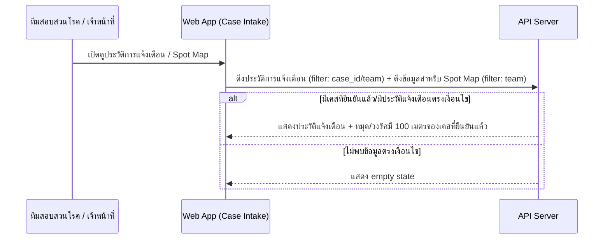

### 3. Business Rule / Validation Logic

| Rule | เงื่อนไข | ผลถ้าไม่ผ่าน | Feature ID |
|---|---|---|---|
| Spot Map แสดงเฉพาะเคสยืนยันแล้ว | `CASE.status = ยืนยันแล้ว` | เคส `รอตรวจสอบ` ไม่ปรากฏบนแผนที่ | FEAT-INTAKE-04 |

### 4. Error & Exception Handling

ไม่มี error ระดับ business-critical เฉพาะสำหรับ flow นี้ตามขอบเขตที่ยืนยันใน Build Plan

### 5. Traceability

| อ้างอิง | ID/ชื่อ |
|---|---|
| Feature | FEAT-INTAKE-03, FEAT-INTAKE-04, FEAT-INTAKE-08 (backlog) |
| Entity | `CASE_NOTIFICATION_LOG`, `CASE` |
| Operation | API-SPEC.md operation 6, 7 |
| Component | Web App (Case Intake), API Server |

---

# โมดูล: Dashboard (`FEAT-DASH-*`)

## Flow 4 — Dashboard View & Filter Recompute (coarse) — `FEAT-DASH-01` ถึง `15`

ยึด [[../01-prototypes/USER-JOURNEY-outbreak-dashboard|USER-JOURNEY-outbreak-dashboard.md]] Step 1-7b เป็นแกน — ขยายรายละเอียดตรงที่ `HIGH-LEVEL-ARCHITECTURE.md` หัวข้อ 3B ยังทำไว้แค่หยาบ (แต่ละ `Dash-->>จนท` เป็น 1 บรรทัด) ให้เห็น recompute logic ตอน filter เปลี่ยน และจุดที่ยังมี gap เรื่องเกณฑ์คำนวณระดับความเสี่ยง

### 1. Flow Overview

| หัวข้อ | รายละเอียด |
|---|---|
| Trigger | เจ้าหน้าที่เฝ้าระวังโรคเปิดหน้า Dashboard ตอนเริ่มกะงาน หรือได้รับแจ้งว่ามีสัญญาณผิดปกติ |
| Actor หลัก | เจ้าหน้าที่เฝ้าระวังโรค / ผู้บริหาร |
| Precondition | มีข้อมูล `CASE`/`ALERT` อยู่ในระบบ |
| Postcondition | เจ้าหน้าที่เห็นภาพรวมสถานการณ์ตามเงื่อนไขกรองปัจจุบัน และตัดสินใจ escalate หรือไม่ escalate |
| Reference | Journey Step 1-7b (`USER-JOURNEY-outbreak-dashboard.md`) · Operation 1-5 (`API-SPEC.md` หัวข้อ 2B) · Entity `CASE`, `ALERT`, `SERVICE_ZONE`, `COMMUNITY`, `DISEASE` · Component Web App (Dashboard), API Server |

### 2. Sequence Flow

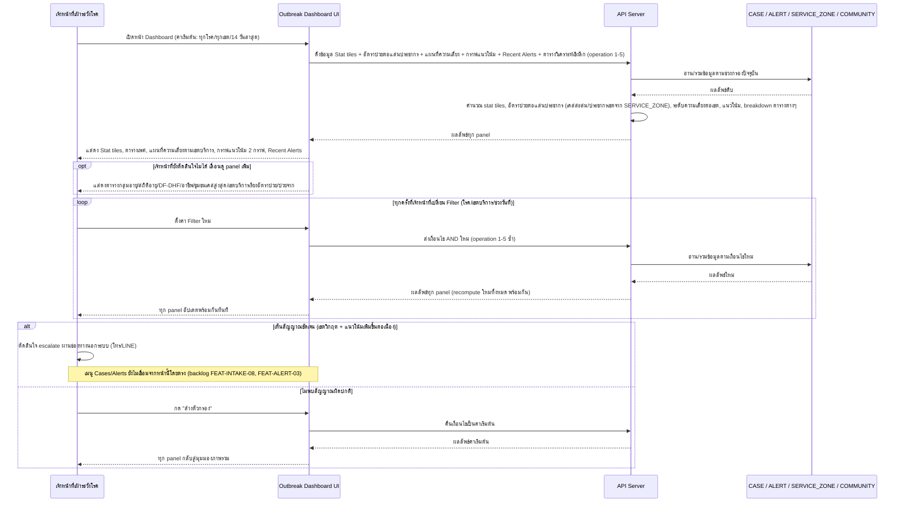

### 3. Business Rule / Validation Logic

| Rule | เงื่อนไข | ผลถ้าไม่ผ่าน | Feature ID |
|---|---|---|---|
| Filter ทำงานแบบ AND ร่วมกันทั้งหมด | โรค + เขตบริการ + ช่วงวันที่ | ทุก panel (FEAT-DASH-02, 03, 04, 05, 07-15) recompute พร้อมกันทันที | FEAT-DASH-06 |
| อัตราป่วยต่อแสนประชากรคำนวณจากเคสสะสม/ประชากรเขต | ใช้ `SERVICE_ZONE.population` | — | FEAT-DASH-07 |
| ระดับความเสี่ยงต่อเขต (ปกติ/เฝ้าระวัง/วิกฤต) | คำนวณจากจำนวนเคส/อัตราป่วยเทียบเกณฑ์ | **เกณฑ์ตัวเลขที่แน่นอนยังไม่ระบุในเอกสาร conceptual ชุดนี้ — ถือเป็น gap ที่ flag ไว้** ต้องยืนยันเพิ่มก่อน implement จริง | FEAT-DASH-03 |
| ตารางวิเคราะห์เชิงลึกด้านประชากร (เพศ/อายุ/อาชีพ/DF-DHF) | ต้องมี field demographic ใน `CASE` | `CASE` ในรอบนี้ยังไม่มี field เพศ/อายุ/อาชีพ/disease_id ที่ยืนยันแล้ว — **gap ที่มีอยู่แล้วใน DATA-MODEL.md** (ไม่ใช่จุดที่ Build Plan รอบนี้อนุมัติให้แก้ `CASE`) | FEAT-DASH-08 ถึง 11 |

### 4. Error & Exception Handling

ไม่มี error ระดับ business-critical เฉพาะสำหรับ flow นี้ตามขอบเขตที่ยืนยันใน Build Plan (Dashboard เป็น read-only, ไม่มีการเขียนข้อมูล) — ความเสี่ยงเดียวที่เกี่ยวข้องคือ escalate ช้าเพราะยังไม่เชื่อม Cases/Alerts จากหน้านี้ (เป็น functional gap ที่ ROADMAP.md Phase 6 ระบุไว้แล้ว ไม่ใช่ error case)

### 5. Traceability

| อ้างอิง | ID/ชื่อ |
|---|---|
| Feature | FEAT-DASH-01 ถึง FEAT-DASH-15 |
| Journey Step | USER-JOURNEY-outbreak-dashboard.md Step 1-7b |
| Entity | `CASE`, `ALERT`, `SERVICE_ZONE`, `COMMUNITY`, `DISEASE` |
| Operation | API-SPEC.md operation 1-5 (หัวข้อ 2B) |
| Component | Web App (Dashboard), API Server |

---

# โมดูล: Case Analysis (`FEAT-ANALYSIS-*`)

## Flow 5 — Case Clustering Confirm & Report Flow (step-by-step ละเอียด) — `FEAT-ANALYSIS-01`/`02`/`04`

### 1. Flow Overview

| หัวข้อ | รายละเอียด |
|---|---|
| Trigger | ทีมสอบสวนโรค (นักระบาดวิทยา) เปิดหน้า Case Analysis เพื่อตรวจสอบ cluster ที่ AI เสนอ |
| Actor หลัก | ทีมสอบสวนโรค (นักระบาดวิทยา) |
| Precondition | มี `CASE_CLUSTER` อย่างน้อย 1 กลุ่มที่ AI เสนอไว้แล้ว (`status = pending`) |
| Postcondition | Cluster ที่เห็นด้วยถูกยืนยัน (`confirmed`) และอาจมี `INVESTIGATION_REPORT` ที่ถูกส่งแล้ว |
| Reference | Operation 1-4 (`API-SPEC.md` หัวข้อ 2C) · Entity `CASE_CLUSTER`, `INVESTIGATION_REPORT`, `CASE` · Component Web App (Case Analysis), API Server, บริการ Case Clustering (backlog `FEAT-ANALYSIS-04`) |

### 2. Sequence Flow

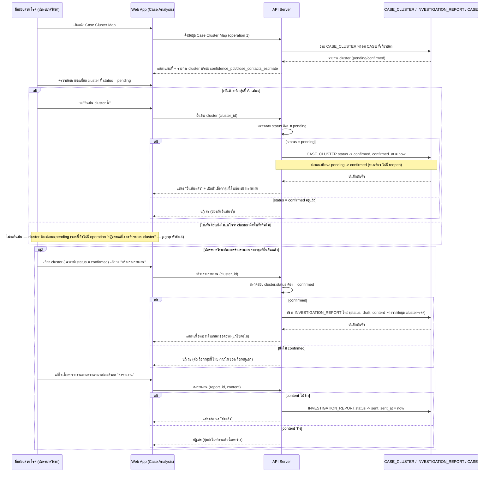

### 3. Business Rule / Validation Logic

| Rule | เงื่อนไข | ผลถ้าไม่ผ่าน | Feature ID |
|---|---|---|---|
| ยืนยัน cluster เป็น one-way | `status = pending` เท่านั้น | ปฏิเสธถ้า confirmed อยู่แล้ว ไม่มี reopen | FEAT-ANALYSIS-01 |
| สร้างรายงานได้เฉพาะ cluster ที่ยืนยันแล้ว | `CASE_CLUSTER.status = confirmed` | ตัวเลือกไม่ปรากฏในช่องเลือก | FEAT-ANALYSIS-02 |
| ส่งรายงานได้ต่อเมื่อเนื้อหาไม่ว่าง | `content` ไม่ว่าง | ปุ่มส่งไม่ทำงาน | FEAT-ANALYSIS-02 |
| 1 cluster มีรายงานได้อย่างมาก 1 ฉบับ | `CASE_CLUSTER` ↔ `INVESTIGATION_REPORT` = 1:1 optional | — | DATA-MODEL.md |

### 4. Error & Exception Handling

| กรณี | จุดที่เกิด (อ้างจาก step ใน diagram) | การจัดการ | ผลกระทบต่อผู้ใช้/ข้อมูล |
|---|---|---|---|
| Cluster ผิดพื้นที่ (AI เสนอผิด) | ตอนนักระบาดวิทยาตรวจสอบ cluster ก่อนยืนยัน | Human-in-the-loop คือกลไกป้องกันหลัก (Decision Log ข้อ 3, `HIGH-LEVEL-ARCHITECTURE.md`) — นักระบาดวิทยาไม่กดยืนยันถ้าเห็นว่าผิด แต่ **รอบนี้ยังไม่มี operation "ปฏิเสธ/แก้ไของค์ประกอบ cluster"** ที่ยืนยันใน Build Plan — cluster ที่ผิดจะค้างสถานะ `pending` ตลอดไปโดยไม่มีทางแก้ไข/ยุบกลุ่มในระบบ — ถือเป็น **gap** ที่ flag ไว้ | เคสที่ AI จัดกลุ่มผิดจะไม่ถูกนำไปทำรายงาน (ปลอดภัยเพราะสร้างรายงานได้เฉพาะ confirmed) แต่ก็ไม่มีทางแก้ไของค์ประกอบกลุ่มให้ถูกต้องได้ในระบบเช่นกัน |
| ยืนยัน cluster ซ้ำ (double-confirm) | ตอนยืนยัน cluster | API ตรวจสอบ `status = pending` ก่อนเปลี่ยนทุกครั้ง | ปฏิเสธคำขอซ้ำ ไม่มีผลข้างเคียง |

### 5. Traceability

| อ้างอิง | ID/ชื่อ |
|---|---|
| Feature | FEAT-ANALYSIS-01, FEAT-ANALYSIS-02, FEAT-ANALYSIS-04 (backlog), FEAT-ANALYSIS-05 (backlog) |
| Entity | `CASE_CLUSTER`, `INVESTIGATION_REPORT`, `CASE` |
| Operation | API-SPEC.md operation 1-4 (หัวข้อ 2C) |
| Component | Web App (Case Analysis), API Server, บริการ Case Clustering (backlog) |

---

## Flow 6 — AI Cluster Suggestion Generation (coarse, system-to-system) — `FEAT-ANALYSIS-04`

### 1. Flow Overview

| หัวข้อ | รายละเอียด |
|---|---|
| Trigger | ระบบวิเคราะห์เชื่อมโยงเคสที่ยืนยันแล้วและยังไม่ถูกจัดกลุ่ม (เป็น system-to-system ไม่ใช่ human trigger โดยตรง) |
| Actor หลัก | ระบบ (API Server + บริการ Case Clustering) |
| Precondition | มีเคสที่ยืนยันแล้วและ `cluster_id = null` |
| Postcondition | อาจมี `CASE_CLUSTER` ใหม่ (`status = pending`) รอนักระบาดวิทยายืนยันต่อใน Flow 5 |
| Reference | ฐานรองรับ Operation 1 (`API-SPEC.md` หัวข้อ 2C) · Entity `CASE`, `CASE_CLUSTER` · Component บริการ Case Clustering (backlog) |

### 2. Sequence Flow

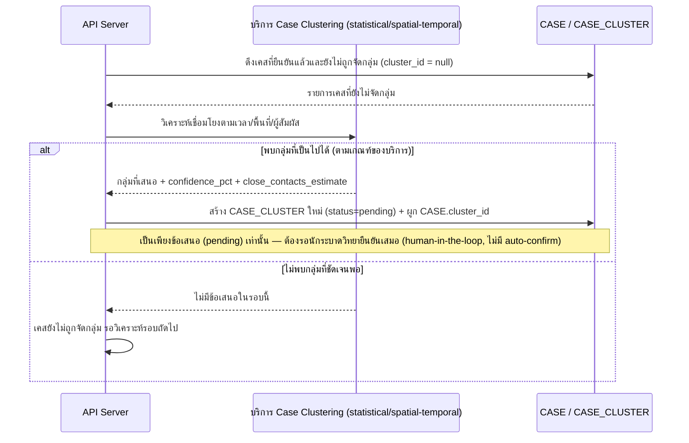

### 3. Business Rule / Validation Logic

| Rule | เงื่อนไข | ผลถ้าไม่ผ่าน | Feature ID |
|---|---|---|---|
| AI เสนอเท่านั้น ไม่ auto-confirm | เสมอ | ต้องผ่าน Flow 5 (human-in-the-loop) ก่อนนำไปใช้จริง | FEAT-ANALYSIS-04 |

### 4. Error & Exception Handling

| กรณี | จุดที่เกิด (อ้างจาก step ใน diagram) | การจัดการ | ผลกระทบต่อผู้ใช้/ข้อมูล |
|---|---|---|---|
| Cluster ผิดพื้นที่ | ตอนบริการ Case Clustering วิเคราะห์ (เช่น ข้อมูลพิกัดไม่แม่นยำ `geo_accuracy = low` ที่ยังไม่ปรับ) | Mitigate ด้วย human-in-the-loop confirm ใน Flow 5 เสมอ — ไม่ auto-commit เข้าเคสจริง | Cluster ที่เสนอผิดจะไม่ถูกยืนยันถ้านักระบาดวิทยาตรวจพบ (ขึ้นกับความละเอียดของการตรวจ) |

### 5. Traceability

| อ้างอิง | ID/ชื่อ |
|---|---|
| Feature | FEAT-ANALYSIS-04 (backlog) |
| Entity | `CASE`, `CASE_CLUSTER` |
| Operation | API-SPEC.md operation 1 (ฐานรองรับ) |
| Component | API Server, บริการ Case Clustering (backlog) |

---

## Flow 7 — ASM Coordination Chat (coarse, scripted demo) — `FEAT-ANALYSIS-03`/`06`

### 1. Flow Overview

| หัวข้อ | รายละเอียด |
|---|---|
| Trigger | ทีมสอบสวนโรคเปิดหน้าต่างสนทนากับ อสม. |
| Actor หลัก | ทีมสอบสวนโรค / อสม. |
| Precondition | — |
| Postcondition | แสดงบทสนทนาตัวอย่างครบตามสคริปต์ (ไม่ persist ข้อมูลจริง) |
| Reference | Operation 5 (`API-SPEC.md` หัวข้อ 2C) · Component Web App (Case Analysis) |

**หมายเหตุสำคัญ**: เป็น **scripted demo แบบ fixed script เท่านั้น ไม่ persist บทสนทนาจริง** ในรอบนี้ (ตรงกับ `DATA-MODEL.md` ที่ระบุว่า `FEAT-ANALYSIS-03` ยังไม่มี entity ของตัวเอง) — ต้องรอ `FEAT-ANALYSIS-06` (chatbot จริง จำกัดสิทธิ์ตาม PDPA) จึงจะมี entity/operation รองรับจริง

### 2. Sequence Flow

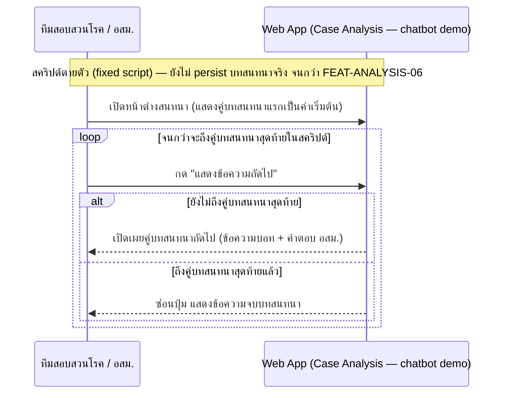

### 3. Business Rule / Validation Logic

| Rule | เงื่อนไข | ผลถ้าไม่ผ่าน | Feature ID |
|---|---|---|---|
| จำกัดสิทธิ์แค่นัดหมาย/แจ้งพื้นที่ (PDPA) | เมื่อเป็น chatbot จริงในอนาคต (`FEAT-ANALYSIS-06`) | ห้ามส่งข้อมูลเคสละเอียดผ่าน chatbot | FEAT-ANALYSIS-06 (backlog) |

### 4. Error & Exception Handling

ไม่มี error ระดับ business-critical สำหรับ flow นี้ (ไม่มีการเขียนข้อมูล/persist ในรอบนี้)

### 5. Traceability

| อ้างอิง | ID/ชื่อ |
|---|---|
| Feature | FEAT-ANALYSIS-03, FEAT-ANALYSIS-06 (backlog) |
| Operation | API-SPEC.md operation 5 |
| Component | Web App (Case Analysis), LINE OA (ช่องทางในอนาคตตาม backlog) |

---

# โมดูล: Control Plan (`FEAT-CONTROL-*`)

## Flow 8 — Control Plan Approval Flow (step-by-step ละเอียด) — `FEAT-CONTROL-01`/`02`

### 1. Flow Overview

| หัวข้อ | รายละเอียด |
|---|---|
| Trigger | ทีมควบคุมโรคต้องการขออนุมัติเบิกน้ำมัน/น้ำยาเคมีสำหรับรอบปฏิบัติงานปัจจุบัน |
| Actor หลัก | ทีมควบคุมโรค (สร้าง/ส่งคำขอ), ผู้บริหาร/หัวหน้างาน (อนุมัติ) |
| Precondition | มีเคส/ตำแหน่งที่ `CONTROL_LOCATION.active = true` อย่างน้อย 1 รายการ |
| Postcondition | `APPROVAL_REQUEST.status = approved` หรือ `rejected` (terminal state ทั้งคู่ — แล้วแต่ผลการพิจารณาของผู้บริหาร) |
| Reference | Operation 5-9 (`API-SPEC.md` หัวข้อ 2D) · Entity `APPROVAL_REQUEST`, `APPROVAL_REQUEST_CASE`, `CASE` · Component Web App (Control Plan), API Server |

### 2. Sequence Flow

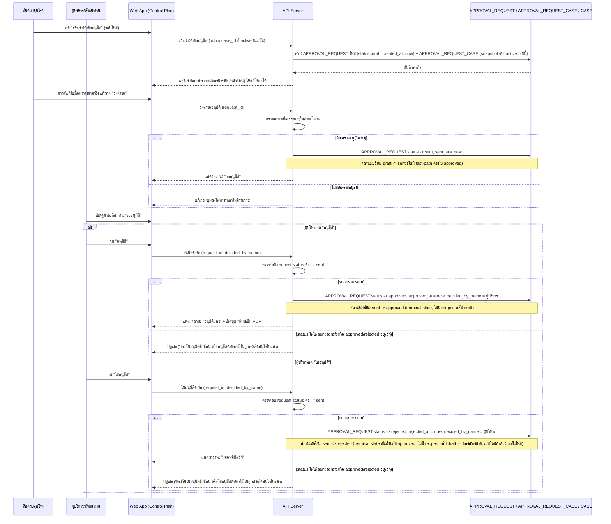

### 2b. State Diagram — `APPROVAL_REQUEST`

> เพิ่มใหม่ในรอบนี้ — `APPROVAL_REQUEST` ข้าม threshold ≥4 สถานะจริงหลังเพิ่ม `rejected` (ดูหัวข้อ 0 ต้นไฟล์)

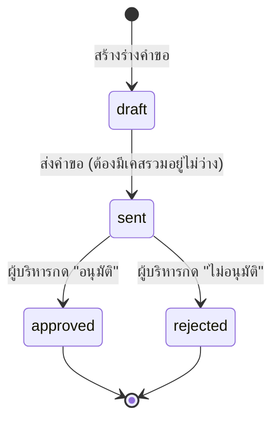

**หมายเหตุ**: `approved` และ `rejected` เป็น terminal state ทั้งคู่ — ไม่มี transition ย้อนกลับ `draft` จากสถานะใดเลย (ต้องสร้าง `APPROVAL_REQUEST` ใหม่ทั้งรายการถ้าต้องการยื่นคำขอรอบใหม่)

### 3. Business Rule / Validation Logic

| Rule | เงื่อนไข | ผลถ้าไม่ผ่าน | Feature ID |
|---|---|---|---|
| draft -> sent ต้องมีเนื้อหาไม่ว่าง | มีเคสรวมอยู่ในคำขออย่างน้อย 1 รายการ | ปุ่มส่งไม่ทำงาน | FEAT-CONTROL-02 |
| sent -> approved เท่านั้น | ไม่มี fast-path จาก draft | ปฏิเสธ ต้องผ่านสถานะ sent ก่อน | FEAT-CONTROL-02 |
| ไม่มี reopen กลับ draft | เสมอ | คำขอที่ approved แล้วคงสถานะตลอดไป | FEAT-CONTROL-02 |
| sent -> rejected เท่านั้น | ไม่มี fast-path จาก draft, เป็น terminal state เช่นเดียวกับ sent -> approved | ปฏิเสธ ต้องผ่านสถานะ sent ก่อน, ไม่มี reopen กลับ draft | FEAT-CONTROL-02 |
| 1 คำขอ = 1 รอบ (batch snapshot) | เก็บเป็น log ประวัติทุกรอบ | เคสเดียวกันปรากฏได้หลายคำขอ/หลายรอบ | DATA-MODEL.md |

### 4. Error & Exception Handling

| กรณี | จุดที่เกิด (อ้างจาก step ใน diagram) | การจัดการ | ผลกระทบต่อผู้ใช้/ข้อมูล |
|---|---|---|---|
| อนุมัติซ้ำซ้อน | ตอนผู้บริหารกด "อนุมัติ" | API ตรวจสอบ `request.status = sent` ก่อนเปลี่ยนเป็น `approved` ทุกครั้ง — ปฏิเสธถ้าเป็น `draft` (ยังไม่ส่ง) หรือ `approved` อยู่แล้ว (อนุมัติซ้ำ) | ป้องกันการเบิกจ่ายซ้ำซ้อนจากคำขอเดียวกัน |
| ไม่อนุมัติซ้ำซ้อน/ไม่อนุมัติคำขอที่ยังไม่ส่ง | ตอนผู้บริหารกด "ไม่อนุมัติ" | API ตรวจสอบ `request.status = sent` ก่อนเปลี่ยนเป็น `rejected` ทุกครั้ง — ปฏิเสธถ้าเป็น `draft` (ยังไม่ส่ง) หรือ `approved`/`rejected` อยู่แล้ว (ตัดสินใจไปแล้ว) | ป้องกันการเปลี่ยนผลการพิจารณาซ้ำซ้อนจากคำขอเดียวกัน |
| ส่งคำขอที่ไม่มีเคสรวมอยู่ | ตอนกด "ส่งคำขอ" | API ตรวจสอบเนื้อหาไม่ว่างก่อนเปลี่ยนเป็น `sent` | ปฏิเสธการส่ง ป้องกันคำขอเปล่า |

### 5. Traceability

| อ้างอิง | ID/ชื่อ |
|---|---|
| Feature | FEAT-CONTROL-01, FEAT-CONTROL-02, FEAT-CONTROL-03 (backlog) |
| Entity | `APPROVAL_REQUEST`, `APPROVAL_REQUEST_CASE`, `CASE` |
| Operation | API-SPEC.md operation 5-9 (หัวข้อ 2D) |
| Component | Web App (Control Plan), API Server |

---

## Flow 9 — Spray Workplan Assignment (coarse) — `FEAT-CONTROL-01`

### 1. Flow Overview

| หัวข้อ | รายละเอียด |
|---|---|
| Trigger | ทีมควบคุมโรคกำหนด/แก้ไขแผนปฏิบัติงานพ่น (มอบหมายทีม+Day 0/1/7+เวลา) และทำเครื่องหมายว่าพ่นแล้ว |
| Actor หลัก | ทีมควบคุมโรค |
| Precondition | มี `CONTROL_LOCATION.active = true` |
| Postcondition | `SPRAY_ASSIGNMENT` ถูกสร้าง/อัปเดต และอาจถูกซ่อนจากตารางเมื่อพ่นครบ Day 0/1/7 |
| Reference | Operation 3, 4 (`API-SPEC.md` หัวข้อ 2D) · Entity `CONTROL_LOCATION`, `SPRAY_ASSIGNMENT` |

### 2. Sequence Flow

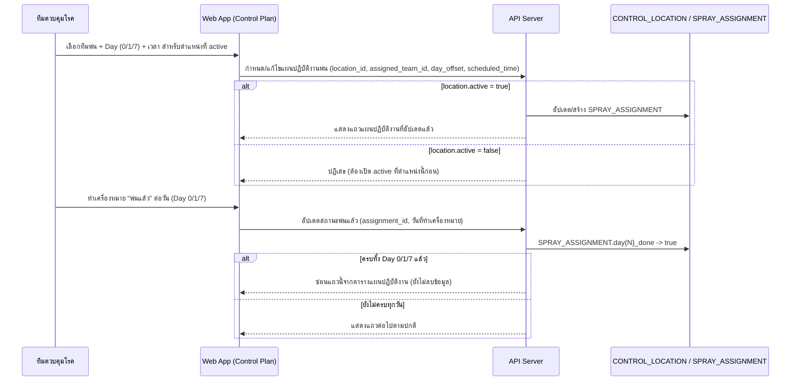

### 3. Business Rule / Validation Logic

| Rule | เงื่อนไข | ผลถ้าไม่ผ่าน | Feature ID |
|---|---|---|---|
| สร้างแผนปฏิบัติงานได้เฉพาะตำแหน่ง active | `CONTROL_LOCATION.active = true` | ปฏิเสธ | FEAT-CONTROL-01 |
| แถวที่พ่นครบ Day 0/1/7 ถูกซ่อนจากตาราง (ไม่ลบ) | `day0_done`/`day1_done`/`day7_done` = true ทั้งหมด | แถวยังอยู่ใน entity แต่ไม่แสดงในตาราง | FEAT-CONTROL-01 |

### 4. Error & Exception Handling

ไม่มี error ระดับ business-critical เฉพาะสำหรับ flow นี้ตามขอบเขตที่ยืนยันใน Build Plan

### 5. Traceability

| อ้างอิง | ID/ชื่อ |
|---|---|
| Feature | FEAT-CONTROL-01, FEAT-CONTROL-04 (backlog), FEAT-CONTROL-05 (backlog) |
| Entity | `CONTROL_LOCATION`, `SPRAY_ASSIGNMENT` |
| Operation | API-SPEC.md operation 3, 4 |
| Component | Web App (Control Plan), API Server |

---

## Flow 10 — Location Management (coarse) — `FEAT-CONTROL-01`/`02`

### 1. Flow Overview

| หัวข้อ | รายละเอียด |
|---|---|
| Trigger | ทีมควบคุมโรคแก้ไขที่อยู่/ชื่อสถานที่/รัศมี หรือเปิด-ปิด active ของตำแหน่งควบคุมโรค |
| Actor หลัก | ทีมควบคุมโรค |
| Precondition | เคสมีตำแหน่งควบคุมโรค (`CONTROL_LOCATION`) อย่างน้อย 1 แห่ง |
| Postcondition | `CONTROL_LOCATION` ที่แก้ไขแล้ว โดยยังคง active อย่างน้อย 1 แห่งต่อเคสเสมอ |
| Reference | Operation 2 (`API-SPEC.md` หัวข้อ 2D) · Entity `CONTROL_LOCATION` |

### 2. Sequence Flow

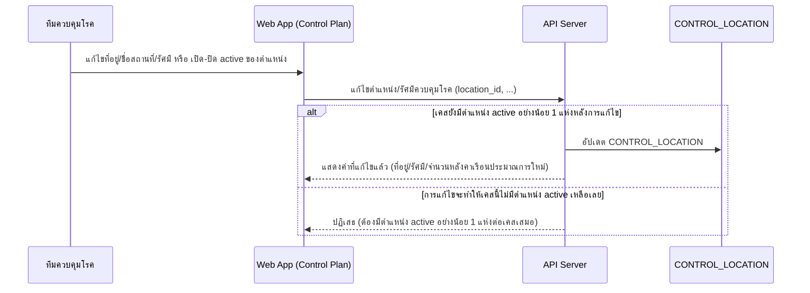

### 3. Business Rule / Validation Logic

| Rule | เงื่อนไข | ผลถ้าไม่ผ่าน | Feature ID |
|---|---|---|---|
| ต้องมีตำแหน่ง active อย่างน้อย 1 แห่งต่อเคสเสมอ | ตรวจก่อนบันทึกทุกครั้ง | ปฏิเสธการปิด active ตำแหน่งสุดท้าย | FEAT-CONTROL-01 |

### 4. Error & Exception Handling

ไม่มี error ระดับ business-critical เฉพาะสำหรับ flow นี้นอกเหนือจาก business rule ข้างต้น (ครอบคลุมแล้วในหัวข้อ 3)

### 5. Traceability

| อ้างอิง | ID/ชื่อ |
|---|---|
| Feature | FEAT-CONTROL-01, FEAT-CONTROL-02 |
| Entity | `CONTROL_LOCATION` |
| Operation | API-SPEC.md operation 2 |
| Component | Web App (Control Plan), API Server |

---

# โมดูล: Field Tracking (`FEAT-TRACK-*`)

## Flow 11 — Team Status Update (coarse) — `FEAT-TRACK-01`

### 1. Flow Overview

| หัวข้อ | รายละเอียด |
|---|---|
| Trigger | ทีมพ่นอัปเดตสถานะปฏิบัติงานภาคสนาม |
| Actor หลัก | ทีมพ่น |
| Precondition | `TEAM.team_type = control` |
| Postcondition | `TEAM.status` เปลี่ยนไปสถานะถัดไป, `last_update_at` อัปเดต |
| Reference | Operation 1, 2 (`API-SPEC.md` หัวข้อ 2E) · Entity `TEAM` |

### 2. Sequence Flow

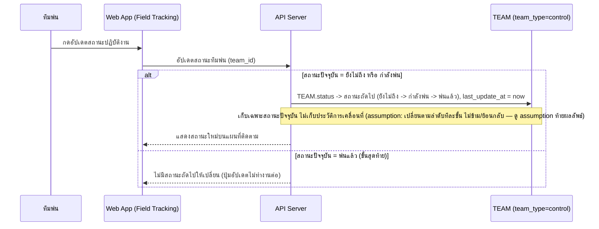

### 3. Business Rule / Validation Logic

| Rule | เงื่อนไข | ผลถ้าไม่ผ่าน | Feature ID |
|---|---|---|---|
| สถานะเปลี่ยนตามลำดับทีละขั้น (ยังไม่ถึง→กำลังพ่น→พ่นแล้ว) | ทุกครั้งที่อัปเดต | ไม่มีสถานะถัดไปเมื่อถึง "พ่นแล้ว" | FEAT-TRACK-01 |
| เก็บเฉพาะสถานะปัจจุบัน ไม่เก็บประวัติการเคลื่อนที่ | เสมอ | — | FEAT-TRACK-01 (DATA-MODEL.md) |

### 4. Error & Exception Handling

ไม่มี error ระดับ business-critical เฉพาะสำหรับ flow นี้ตามขอบเขตที่ยืนยันใน Build Plan

### 5. Traceability

| อ้างอิง | ID/ชื่อ |
|---|---|
| Feature | FEAT-TRACK-01, FEAT-CONTROL-04 (backlog) |
| Entity | `TEAM` |
| Operation | API-SPEC.md operation 1, 2 (หัวข้อ 2E) |
| Component | Web App (Field Tracking), API Server, บริการติดตามตำแหน่งทีมพ่น (backlog) |

---

## Flow 12 — AI Vision QC + Manual Check (coarse) — `FEAT-TRACK-02`

### 1. Flow Overview

| หัวข้อ | รายละเอียด |
|---|---|
| Trigger | ทีมควบคุมโรคเปิดดูรูปภาคสนามพร้อมผลตรวจ AI Vision QC |
| Actor หลัก | ทีมควบคุมโรค |
| Precondition | มี `FIELD_PHOTO` ที่ผ่านการประเมินจากบริการ AI Vision QC แล้ว |
| Postcondition | รูปที่ AI ตรวจไม่ผ่านอาจถูกตรวจสอบด้วยมือ (`manual_checked = true`) |
| Reference | Operation 3, 4 (`API-SPEC.md` หัวข้อ 2E) · Entity `FIELD_PHOTO` · Component บริการ AI Vision QC (backlog `FEAT-CONTROL-05`) |

### 2. Sequence Flow

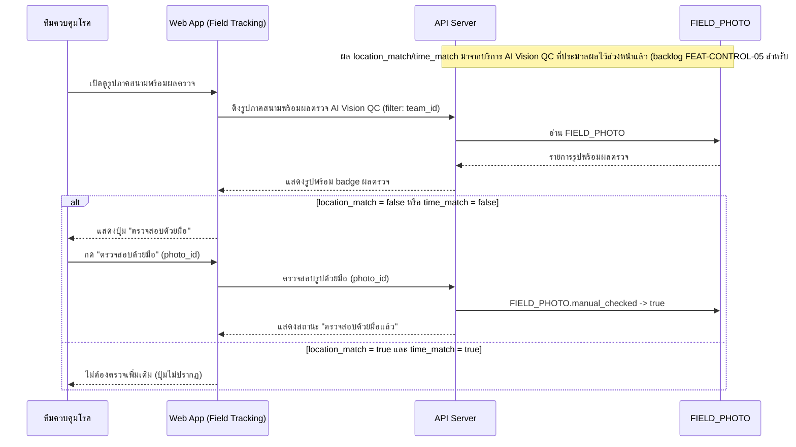

### 3. Business Rule / Validation Logic

| Rule | เงื่อนไข | ผลถ้าไม่ผ่าน | Feature ID |
|---|---|---|---|
| ตรวจสอบด้วยมือได้เฉพาะรูปที่ AI ตรวจไม่ผ่านอย่างน้อย 1 ด้าน | `location_match = false` หรือ `time_match = false` | ปุ่ม "ตรวจสอบด้วยมือ" ไม่ปรากฏ | FEAT-TRACK-02 |

### 4. Error & Exception Handling

ไม่มี error ระดับ business-critical เฉพาะสำหรับ flow นี้ตามขอบเขตที่ยืนยันใน Build Plan

### 5. Traceability

| อ้างอิง | ID/ชื่อ |
|---|---|
| Feature | FEAT-TRACK-02, FEAT-CONTROL-05 (backlog) |
| Entity | `FIELD_PHOTO` |
| Operation | API-SPEC.md operation 3, 4 |
| Component | Web App (Field Tracking), API Server, บริการ AI Vision QC (backlog) |

---

# โมดูล: ASM Coordination (`FEAT-ASM-*`)

## Flow 13 — Photo Intake Query/Filter (coarse) — `FEAT-ASM-01`

### 1. Flow Overview

| หัวข้อ | รายละเอียด |
|---|---|
| Trigger | ทีมควบคุมโรคเปิดหน้าเพื่อดูรูปยืนยันพ่นที่ อสม. ส่งเข้ามา |
| Actor หลัก | ทีมควบคุมโรค |
| Precondition | มี `ASM_PHOTO_INTAKE` ในระบบ |
| Postcondition | เห็นรายการรูปพร้อมสถานะสรุปโดย AI (พ่นแล้ว/ยังไม่พ่น) |
| Reference | Operation 1 (`API-SPEC.md` หัวข้อ 2F) · Entity `ASM_PHOTO_INTAKE` |

### 2. Sequence Flow

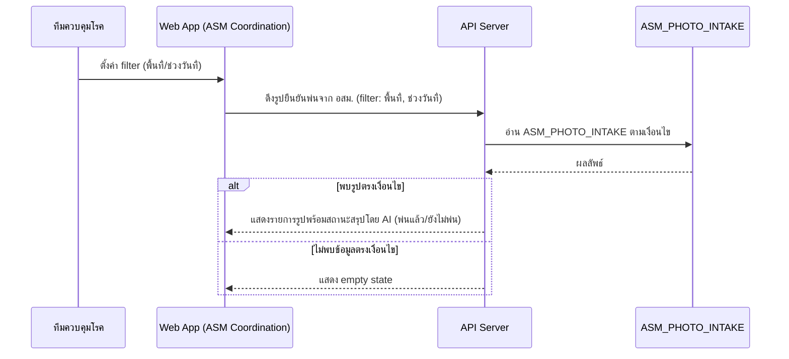

### 3. Business Rule / Validation Logic

| Rule | เงื่อนไข | ผลถ้าไม่ผ่าน | Feature ID |
|---|---|---|---|
| สถานะพ่นแล้ว/ยังไม่พ่น เป็น read-only ผลจาก AI | รอบนี้ยังไม่มี manual override ที่ยืนยัน | ผู้ใช้แก้ไขสถานะไม่ได้ในรอบนี้ | FEAT-ASM-01 |

### 4. Error & Exception Handling

ไม่มี error ระดับ business-critical เฉพาะสำหรับ flow นี้ตามขอบเขตที่ยืนยันใน Build Plan

### 5. Traceability

| อ้างอิง | ID/ชื่อ |
|---|---|
| Feature | FEAT-ASM-01, FEAT-ASM-03 (backlog) |
| Entity | `ASM_PHOTO_INTAKE` |
| Operation | API-SPEC.md operation 1 |
| Component | Web App (ASM Coordination), API Server, LINE OA (backlog) |

---

## Flow 14 — Advance Notice Queue (coarse) — `FEAT-ASM-02`

### 1. Flow Overview

| หัวข้อ | รายละเอียด |
|---|---|
| Trigger | ทีมควบคุมโรคเปิดดูคิวแจ้งเตือนล่วงหน้าก่อนวันพ่น (รอบ 1 ก่อน Day 0, รอบ 2 ก่อน Day 0+7) |
| Actor หลัก | ทีมควบคุมโรค |
| Precondition | มี `ADVANCE_NOTICE_QUEUE` ในระบบ |
| Postcondition | เห็นตัวอย่างข้อความ/สถานะการส่งของแต่ละรอบแจ้งเตือน |
| Reference | Operation 2, 3 (`API-SPEC.md` หัวข้อ 2F) · Entity `ADVANCE_NOTICE_QUEUE` |

### 2. Sequence Flow

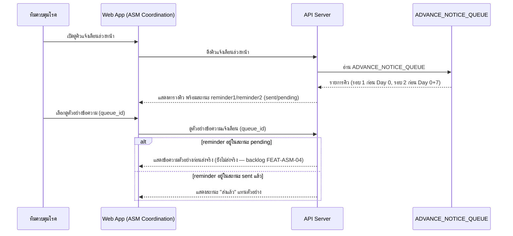

### 3. Business Rule / Validation Logic

| Rule | เงื่อนไข | ผลถ้าไม่ผ่าน | Feature ID |
|---|---|---|---|
| 2 รอบแจ้งเตือนต่อพื้นที่ (ก่อน Day 0 / ก่อน Day 0+7) | เก็บแบบ embedded ต่อแถว | — | FEAT-ASM-02 |

### 4. Error & Exception Handling

ไม่มี error ระดับ business-critical เฉพาะสำหรับ flow นี้ตามขอบเขตที่ยืนยันใน Build Plan — ข้อจำกัดเรื่อง quota ของ LINE Messaging API (`HIGH-LEVEL-ARCHITECTURE.md` หัวข้อ 4) เป็นข้อจำกัดทางเทคนิคทั่วไป ไม่ใช่ 1 ใน 5 ประเภท error ที่ยืนยันในขอบเขตรอบนี้

### 5. Traceability

| อ้างอิง | ID/ชื่อ |
|---|---|
| Feature | FEAT-ASM-02, FEAT-ASM-04 (backlog) |
| Entity | `ADVANCE_NOTICE_QUEUE` |
| Operation | API-SPEC.md operation 2, 3 |
| Component | Web App (ASM Coordination), API Server, LINE OA (backlog) |

---

# โมดูล: Reports (`FEAT-REPORT-*`)

## Flow 15 — Generate & Send Summary Report (coarse) — `FEAT-REPORT-01`/`02`

### 1. Flow Overview

| หัวข้อ | รายละเอียด |
|---|---|
| Trigger | ผู้บริหาร/เจ้าหน้าที่ต้องการสรุปสถานการณ์ประจำวัน/สัปดาห์ |
| Actor หลัก | ผู้บริหาร / เจ้าหน้าที่ |
| Precondition | — |
| Postcondition | `REPORT_SEND_LOG` ใหม่ถูกสร้าง (เมื่อส่งสำเร็จ) |
| Reference | Operation 1-3 (`API-SPEC.md` หัวข้อ 2G) · Entity `REPORT_SEND_LOG`, `CASE`, `SPRAY_ASSIGNMENT`, `FIELD_PHOTO`, `INVESTIGATION_REPORT` |

### 2. Sequence Flow

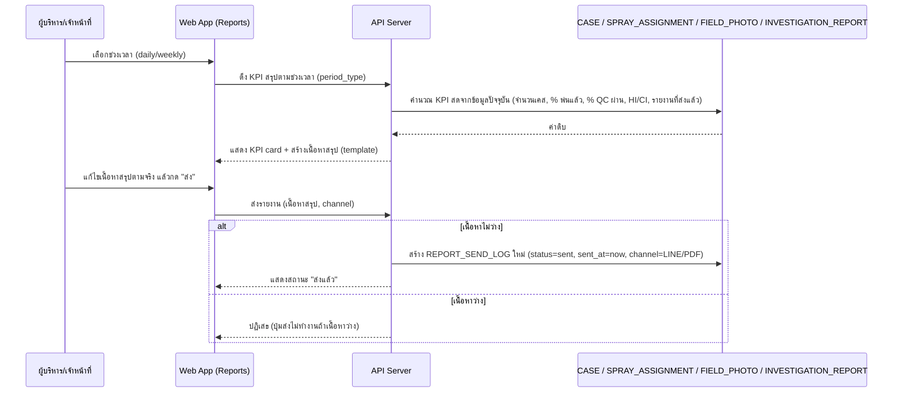

### 3. Business Rule / Validation Logic

| Rule | เงื่อนไข | ผลถ้าไม่ผ่าน | Feature ID |
|---|---|---|---|
| ส่งรายงานได้ต่อเมื่อเนื้อหาไม่ว่าง | `content` ไม่ว่าง | ปุ่มส่งไม่ทำงาน | FEAT-REPORT-02 |
| KPI เป็นค่าคำนวณสด ไม่ persist แยก | เสมอ | — (`REPORT_SEND_LOG` เก็บเฉพาะ snapshot ตอนส่ง) | FEAT-REPORT-01 |

### 4. Error & Exception Handling

ไม่มี error ระดับ business-critical เฉพาะสำหรับ flow นี้ตามขอบเขตที่ยืนยันใน Build Plan — ความเสี่ยงที่ข้อมูลสรุปไม่ครบถ้วนเพราะพึ่งพาคุณภาพข้อมูล Phase 1-4 เป็นข้อจำกัดที่ ROADMAP.md ระบุไว้แล้ว ไม่ใช่ error case ที่ต้อง handle ในระบบ

### 5. Traceability

| อ้างอิง | ID/ชื่อ |
|---|---|
| Feature | FEAT-REPORT-01, FEAT-REPORT-02, FEAT-REPORT-03 (backlog) |
| Entity | `REPORT_SEND_LOG`, `CASE`, `SPRAY_ASSIGNMENT`, `FIELD_PHOTO`, `INVESTIGATION_REPORT` |
| Operation | API-SPEC.md operation 1-3 (หัวข้อ 2G) |
| Component | Web App (Reports), API Server |

---

# โมดูล: Alerts (`FEAT-ALERT-*`)

## Flow 16 — Alert Assign & Close Flow (step-by-step ละเอียด) — `FEAT-ALERT-01`/`02`

### 1. Flow Overview

| หัวข้อ | รายละเอียด |
|---|---|
| Trigger | เจ้าหน้าที่เฝ้าระวังโรคเห็นแจ้งเตือนสถานะ "ใหม่" (`new`) ต้องมอบหมายทีมไปดำเนินการ |
| Actor หลัก | เจ้าหน้าที่เฝ้าระวังโรค (มอบหมาย), ทีมที่ได้รับมอบหมาย (ปิดเคส) |
| Precondition | `ALERT.status = new` |
| Postcondition | `ALERT.status = closed` พร้อม `close_note` (ถ้าดำเนินการครบ flow) |
| Reference | Operation 1-3 (`API-SPEC.md` หัวข้อ 2H) · Entity `ALERT`, `TEAM`, `DISEASE`, `SERVICE_ZONE` |

### 2. Sequence Flow

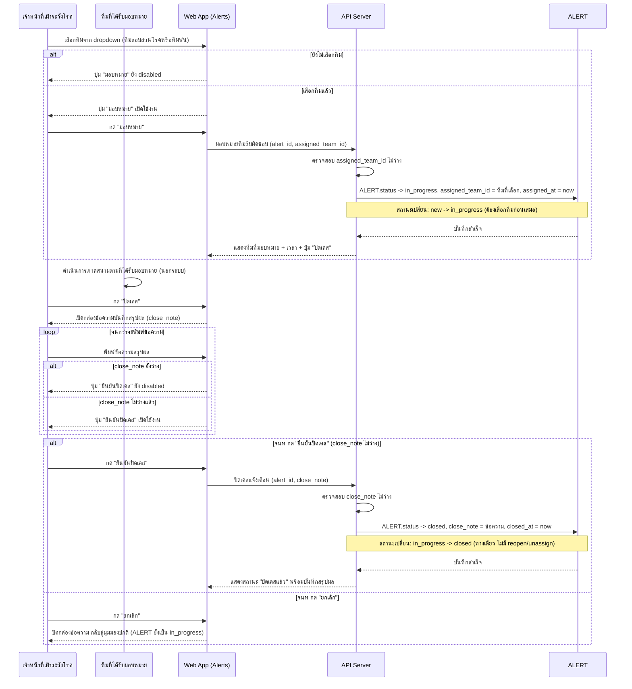

### 3. Business Rule / Validation Logic

| Rule | เงื่อนไข | ผลถ้าไม่ผ่าน | Feature ID |
|---|---|---|---|
| มอบหมายทีมต้องเลือกทีมก่อนเปลี่ยนเป็น in_progress | `assigned_team_id` ไม่ว่าง | ปุ่ม "มอบหมาย" disabled | FEAT-ALERT-02 |
| ปิดเคสต้องมี close_note ไม่ว่างก่อนเปลี่ยนเป็น closed | `close_note` ไม่ว่าง | ปุ่ม "ยืนยันปิดเคส" disabled | FEAT-ALERT-02 |
| ไม่มี reopen/unassign ในรอบนี้ | เสมอ | เคสที่ `closed` คงสถานะตลอดไป | FEAT-ALERT-02 |

### 4. Error & Exception Handling

| กรณี | จุดที่เกิด (อ้างจาก step ใน diagram) | การจัดการ | ผลกระทบต่อผู้ใช้/ข้อมูล |
|---|---|---|---|
| ปิด alert โดยไม่มี note | ตอนกด "ยืนยันปิดเคส" | UI disable ปุ่มตั้งแต่ `close_note` ยังว่าง (client-side) + API ต้อง reject ซ้ำอีกชั้นถ้าเรียกตรงโดยไม่ผ่าน UI (server-side validation) | ป้องกัน `ALERT.status = closed` ที่ไม่มีบันทึกสรุปผล ซึ่งจะทำให้ตรวจสอบย้อนหลังไม่ได้ |
| แจ้งเตือนผิดทีม (มอบหมายไม่มีทีม/ทีมว่าง) | ตอนกด "มอบหมาย" | UI disable ปุ่ม "มอบหมาย" จนกว่าจะเลือกทีมจาก dropdown | ป้องกัน `ALERT.status = in_progress` ที่ไม่มีทีมรับผิดชอบชัดเจน |

### 5. Traceability

| อ้างอิง | ID/ชื่อ |
|---|---|
| Feature | FEAT-ALERT-01, FEAT-ALERT-02, FEAT-ALERT-03 (backlog) |
| Entity | `ALERT`, `TEAM`, `DISEASE`, `SERVICE_ZONE` |
| Operation | API-SPEC.md operation 1-3 (หัวข้อ 2H) |
| Component | Web App (Alerts), API Server |

---

## สรุป Gap/Assumption ที่พบระหว่างเขียนเอกสารนี้

- **[Gap] เกณฑ์คำนวณระดับความเสี่ยงต่อเขต (ปกติ/เฝ้าระวัง/วิกฤต)** ยังไม่ระบุตัวเลขที่แน่นอนใน `DATA-MODEL.md`/`API-SPEC.md` — Flow 4 (Dashboard) จึงระบุแค่ "คำนวณจากจำนวนเคส/อัตราป่วยเทียบเกณฑ์" แบบ conceptual เท่านั้น
- **[Gap] Case Intake ไม่มี dedup rule สำหรับเคสซ้ำ** (อัปโหลดไฟล์/HN ซ้ำ) — Flow 1 flag ไว้เป็น error case ที่ยังไม่มีการจัดการ
- **[Gap] Case Analysis ไม่มี operation "ปฏิเสธ/แก้ไของค์ประกอบ cluster ที่ผิด"** — Flow 5 flag ไว้ว่า cluster ที่นักระบาดวิทยาเห็นว่าผิดพื้นที่จะค้างสถานะ `pending` ตลอดไปโดยไม่มีทางแก้ไขในระบบ
- **[Gap] Case Intake — การกำหนด `responsible_team` เริ่มต้นตอนสร้างเคสใหม่เมื่อ OCR ดึงตำบลที่ไม่ตรง `SUBDISTRICT_ROUTING_RULE` ใดเลย** ไม่มีการระบุ behavior ชัดเจนใน `API-SPEC.md`/`DATA-MODEL.md` (มีแต่ตอนแก้ไข) — เอกสารนี้สันนิษฐานว่าใช้ lookup เดียวกันตอนสร้างเคส (Flow 1 step แรก) แต่ยังไม่ยืนยันว่าเกิดอะไรขึ้นถ้าไม่ตรง (ปล่อยว่าง/ต้องเลือกด้วยมือ) — ต้องยืนยันเพิ่มก่อน implement จริง
- **[Assumption] Field Tracking — ลำดับการเปลี่ยนสถานะทีมพ่น (`not_arrived` → `spraying` → `done`)** สันนิษฐานว่าเป็นลำดับทางเดียวทีละขั้น ไม่ข้าม/ย้อนกลับ ตามรูปแบบ one-way transition ที่ใช้ทั่วทั้งระบบ (`CASE`, `CASE_CLUSTER`, `ALERT`, `APPROVAL_REQUEST`) — ไม่ได้ระบุไว้ชัดเจนเป็นคำต่อคำใน `DATA-MODEL.md`

---

หมายเหตุ: เอกสารนี้ไม่มี State/Status Diagram แยกตามที่ยืนยันใน Build Plan รอบนี้ — ถ้าในอนาคตมี entity ที่ขยายเป็น ≥4 สถานะ ควรทบทวนและเพิ่มหัวข้อ State/Status Diagram ต่อ flow ที่เกี่ยวข้อง
