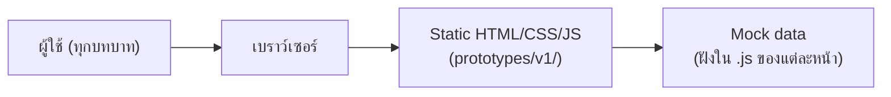
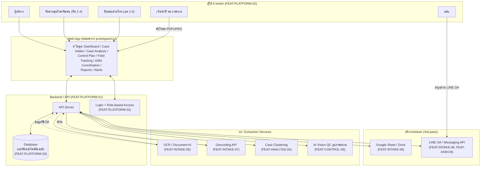
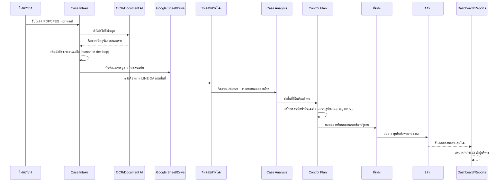
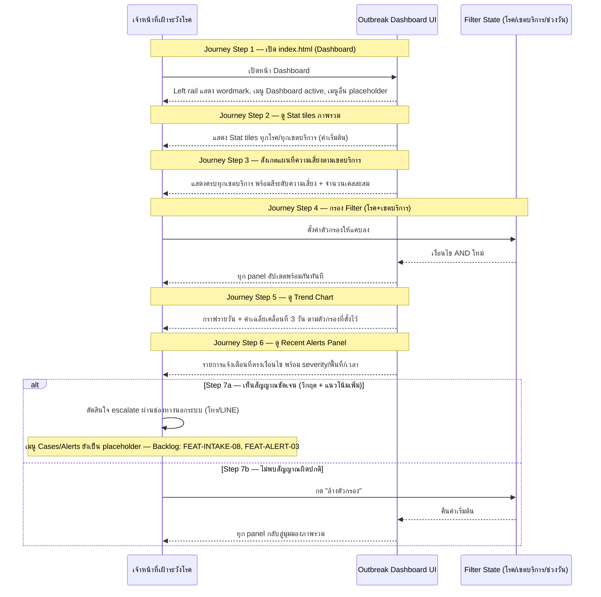

# High Level Architecture — AI-DSRP

อ้างอิงจาก [[../../../ROADMAP.md|ROADMAP.md]] (เฟสการเชื่อมต่อจริง) และ [[../../01-requirements/01-spec/FEATURE-LIST|FEATURE-LIST.md]] (ฟีเจอร์ต่อโมดูล) — เอกสารนี้อธิบาย 2 สถานะ: **สถานะปัจจุบัน** (prototype) และ **สถานะเป้าหมาย** (หลังเชื่อมต่อจริงตาม Phase 1-8)

## 1. สถานะปัจจุบัน (Prototype)

8 หน้า (`index.html`, `case-intake.html`, `case-analysis.html`, `control-plan.html`, `field-tracking.html`, `asm-coordination.html`, `reports.html`, `alerts.html`) เป็นไฟล์อิสระต่อกัน แต่ละหน้ามี mock data ของตัวเอง **ไม่มี backend, ไม่มี database, ไม่มี authentication จริง** — ทุก interaction (ยืนยัน, ส่งอนุมัติ, แจ้งเตือน) เป็น client-side state ที่หายไปเมื่อ reload หน้า

## 2. สถานะเป้าหมาย (หลัง Phase 1-8 ตาม ROADMAP.md)

### คำอธิบายแต่ละส่วน

| Layer | องค์ประกอบ | เชื่อมโยง Feature/Phase |
|---|---|---|
| **Users** | 6 บทบาทตาม role-based access | FEAT-PLATFORM-02 (Phase 7) |
| **Frontend** | Web app ต่อยอดจาก 8 หน้า prototype ปัจจุบัน | FEAT-DASH, FEAT-INTAKE, FEAT-ANALYSIS, FEAT-CONTROL, FEAT-TRACK, FEAT-ASM, FEAT-REPORT, FEAT-ALERT |
| **Backend/API** | API Server กลาง + Auth + Database | FEAT-PLATFORM-01/02/03 (Phase 7) |
| **AI Services** | OCR/Document AI, Geocoding, Case Clustering, Vision QC | FEAT-INTAKE-05/07, FEAT-ANALYSIS-04, FEAT-CONTROL-05 (Phase 1-3) |
| **External** | Google Sheet/Drive (เก็บข้อมูล+ไฟล์ต้นฉบับ), LINE OA (แจ้งเตือน/รับรูป) | FEAT-INTAKE-06/08, FEAT-ASM-03/04 (Phase 1, 4) |

## 3. Data Flow หลัก (เคสไข้เลือดออก 1 เคส)

## 3B. Data Flow ตาม User Journey — Outbreak Dashboard

Diagram นี้แปลงมาจากขั้นตอนจริงใน [[../01-prototypes/USER-JOURNEY-outbreak-dashboard|USER-JOURNEY-outbreak-dashboard.md]] (persona: สมศักดิ์ สุขวัฒน์ เจ้าหน้าที่เฝ้าระวังโรค) แบบ 1:1 ต่อ step — ใช้คำศัพท์ปัจจุบันที่ตรงกับ `prototypes/v1/index.html` จริง (เช่น "เขตบริการ", "Stat tiles", "แผนที่ความเสี่ยงตามเขตบริการ") แทนคำเดิมในเอกสาร journey ("ภูมิภาค", "KPI Cards") ที่เขียนไว้ก่อนหน้าจะปรับโครงสร้าง 2 รอบหลังสุด

### Journey Step ↔ Diagram interaction ↔ Feature ID

| Journey Step | Interaction ใน Diagram | Feature ID |
|---|---|---|
| 1. เปิด index.html (Dashboard) | จนท->>Dash: เปิดหน้า Dashboard / Dash-->>จนท: left rail + เมนู | FEAT-DASH-01 |
| 2. ดู Stat tiles ภาพรวม | Dash-->>จนท: แสดง Stat tiles ค่าเริ่มต้น | FEAT-DASH-02 |
| 3. สังเกตแผนที่ความเสี่ยงตามเขตบริการ | Dash-->>จนท: แสดงครบทุกเขตบริการ + สีความเสี่ยง | FEAT-DASH-03 |
| 4. กรอง Filter (โรค+เขตบริการ) | จนท->>Filter / Filter-->>Dash / Dash-->>จนท: panel อัปเดตพร้อมกัน | FEAT-DASH-06 |
| 5. ดู Trend Chart | Dash-->>จนท: กราฟรายวัน + ค่าเฉลี่ยเคลื่อนที่ 3 วัน | FEAT-DASH-04 |
| 6. ดู Recent Alerts Panel | Dash-->>จนท: รายการแจ้งเตือนตรงเงื่อนไข | FEAT-DASH-05 |
| 7a. เห็นสัญญาณชัดเจน → escalate นอกระบบ | alt branch: จนท->>จนท ตัดสินใจ escalate | Backlog: FEAT-INTAKE-08, FEAT-ALERT-03 |
| 7b. ไม่พบสัญญาณผิดปกติ → ล้างตัวกรอง | else branch: จนท->>Filter / Filter-->>Dash / Dash-->>จนท | FEAT-DASH-06 |

## 4. ข้อจำกัดทางเทคนิคที่ต้องพิจารณาก่อนสร้างจริง

อ้างอิงจากคำเตือนที่มีอยู่แล้วใน ROADMAP.md:

- **LINE ไม่มี API ติดตามตำแหน่งต่อเนื่อง** (Phase 3) — "location sharing" ของ LINE เป็นครั้งเดียว ต้องใช้แอป LIFF แยกถ้าต้องการ real-time tracking ทีมพ่น
- **รูปที่ส่งผ่าน LINE มักถูกล้าง EXIF/geotag** (Phase 3-4) — ต้องเก็บพิกัด/เวลาแยกตอนถ่ายผ่านแอป (LIFF ขอสิทธิ์ตำแหน่ง) ไม่ใช่ดึงจาก metadata ไฟล์ที่ส่งมา
- **LINE Messaging API มี quota** (free tier จำกัดจำนวนข้อความ/เดือน) — ต้องเช็คก่อน scale การแจ้งเตือนอัตโนมัติ (Phase 4)
- **PDPA** — ข้อมูลสุขภาพที่ส่งผ่าน 3rd-party API (Google/LINE) ต้องทบทวนให้สอดคล้องกฎหมาย โดยเฉพาะ chatbot อสม. (Phase 2) และรูปภาคสนาม (Phase 3-4) — chatbot ต้องจำกัดสิทธิ์แค่นัดหมาย/แจ้งพื้นที่ ห้ามส่งข้อมูลเคสละเอียด
- **Case clustering ต้องมี human-in-the-loop เสมอ** (Phase 2) — AI เสนอ cluster ที่เป็นไปได้เท่านั้น นักระบาดวิทยายืนยันก่อนทุกครั้ง เพราะ cluster ผิดอาจทำให้ทุ่มทรัพยากรผิดพื้นที่

## 5. ลำดับการสร้างจริง (อ้างอิง Phase ใน ROADMAP.md)

Phase 7 (Platform Foundations: Backend/API, Auth, Database) ควรทำคู่ขนานหรือก่อน Phase 1-4 เพราะทุกโมดูลพึ่งพา แต่ Phase 5 (รายงานสรุปอัตโนมัติ) ต้องทำ**หลังสุด**เพราะขึ้นกับคุณภาพข้อมูลจาก Phase 1-4 ทั้งหมด (ระบุไว้ชัดเจนใน ROADMAP.md แล้ว) — Phase 8 (Hardening: performance/security/accessibility) ทำเป็นลำดับสุดท้ายก่อนใช้งานจริง
